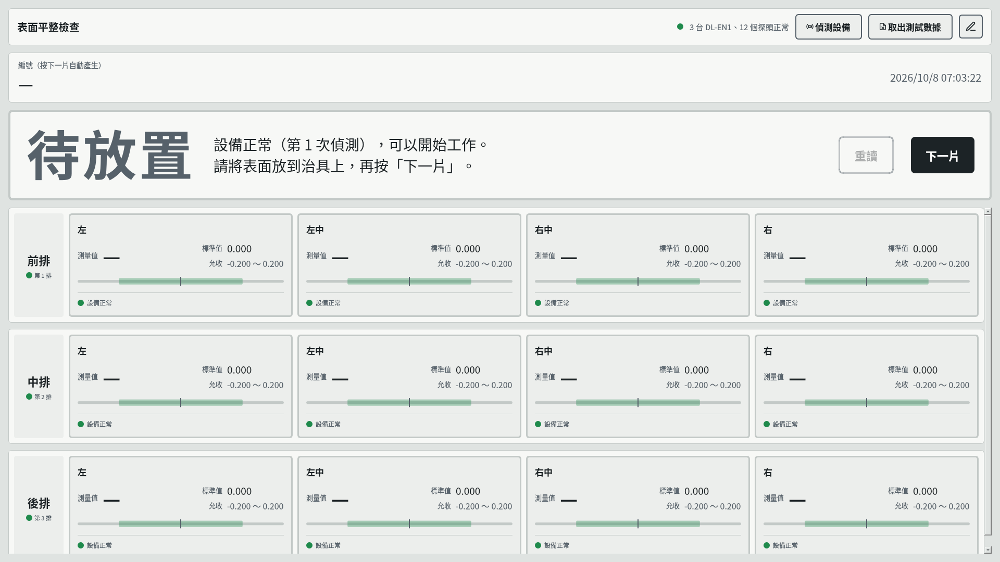
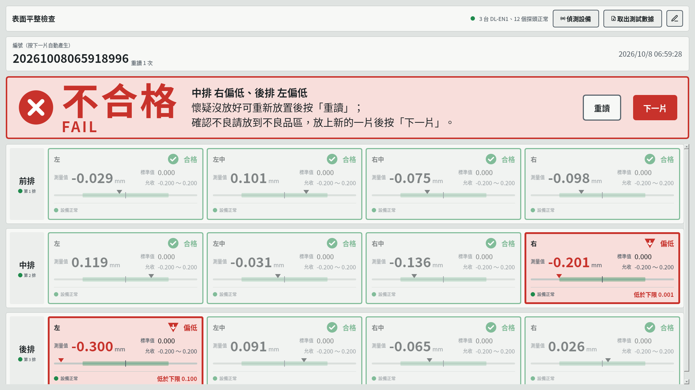
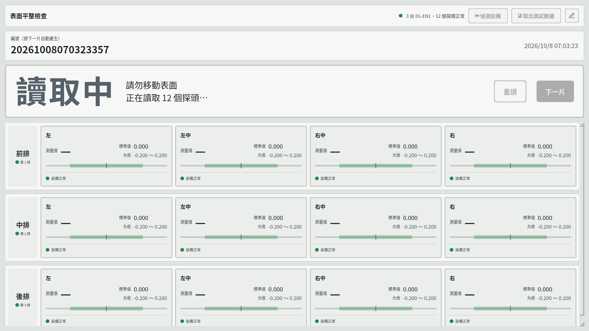
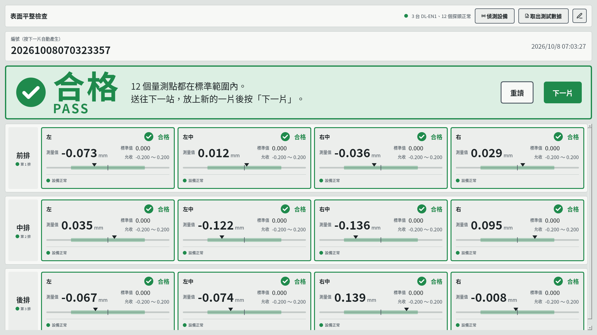
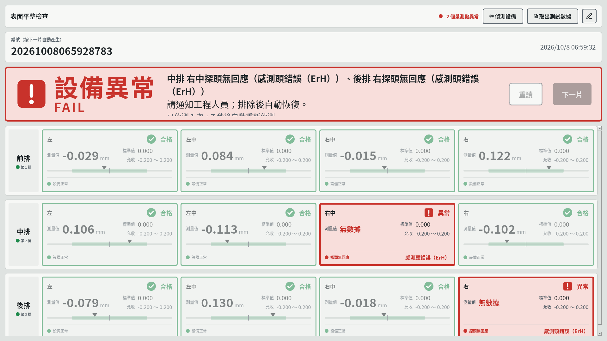
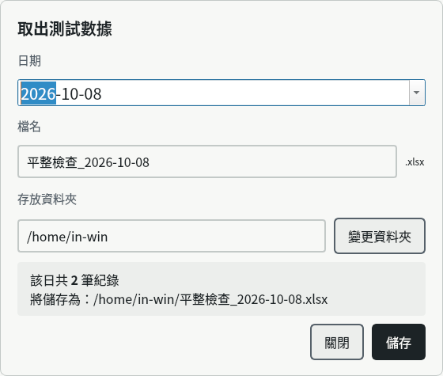
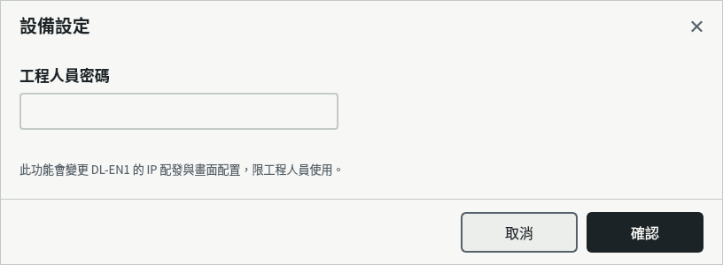
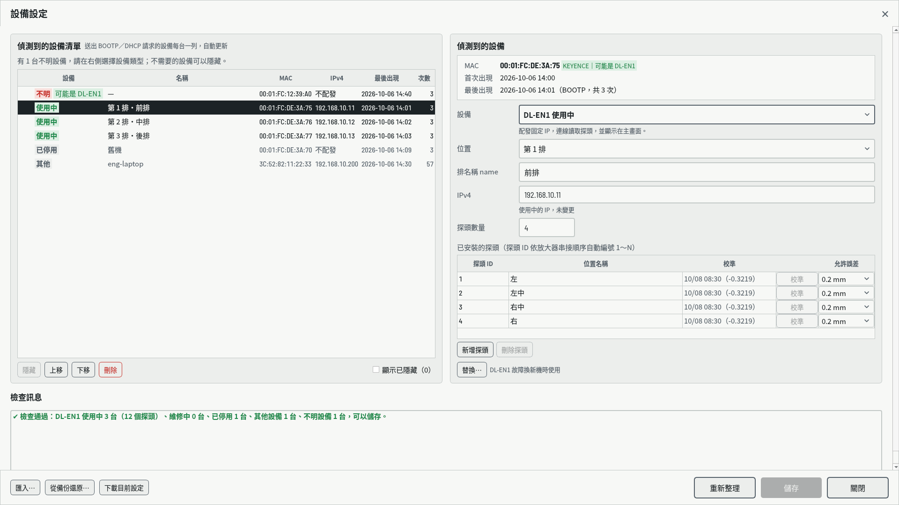
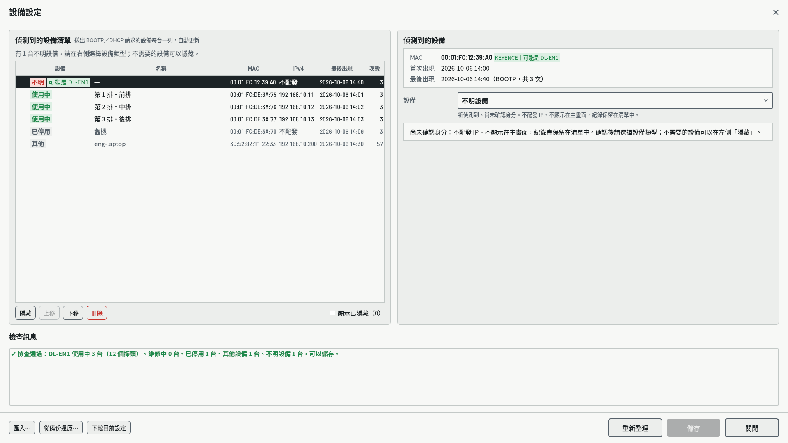
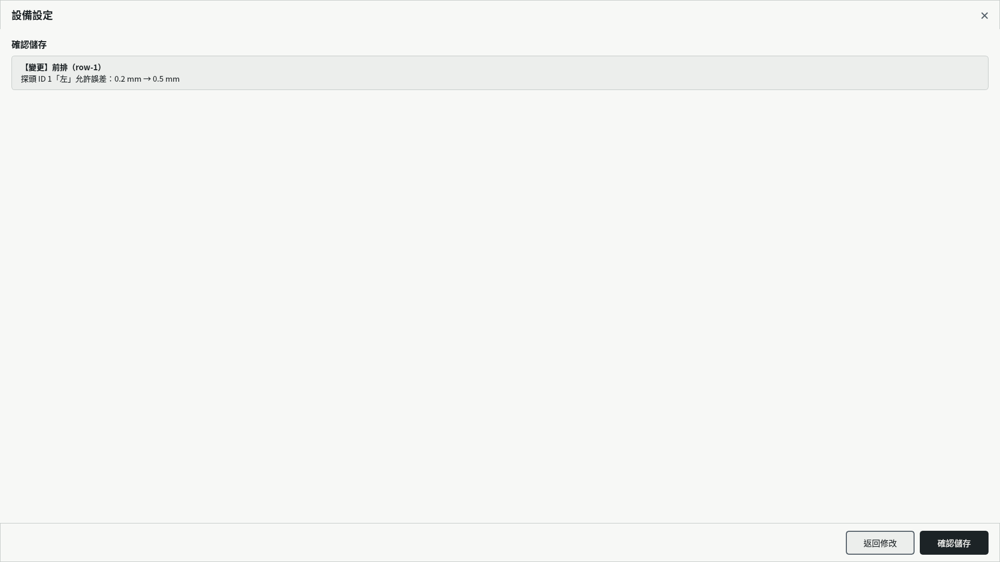

# 表面平整檢查系統 操作說明書

| 項目 | 內容 |
| --- | --- |
| 適用版本 | 2026-10-08（repo `main`） |
| 依據 | 《表面平整檢查系統 需求規格書》（`Downloads/表面平整檢查系統_需求規格書.md`）；各節標題後的括號為對應的需求編號 |
| 讀者 | 作業員：第 1～6 章　工程人員：第 7～10 章　維護人員：第 11 章 |
| 截圖 | 以示範資料產生（3 排、每排 4 個探頭、允許誤差 0.2 mm），數值僅供說明 |

---

## 目錄

1. [系統概要](#1-系統概要)
2. [開機、啟動與關閉](#2-開機啟動與關閉)
3. [主畫面導覽](#3-主畫面導覽)
4. [作業員：每片的量測流程](#4-作業員每片的量測流程)
5. [作業員：看懂結果與處理方式](#5-作業員看懂結果與處理方式)
6. [作業員：取出測試數據（Excel）](#6-作業員取出測試數據excel)
7. [工程人員：設備設定](#7-工程人員設備設定)
8. [工程人員：探頭校準](#8-工程人員探頭校準)
9. [工程人員：判定規則與允許誤差](#9-工程人員判定規則與允許誤差)
10. [異常訊息與排除方式](#10-異常訊息與排除方式)
11. [維護人員：系統維護](#11-維護人員系統維護)
12. [附錄](#12-附錄)

---

## 1. 系統概要

本系統在每一片工件放上治具後，同時讀取多個接觸式探頭的高度，逐點判定是否在允收範圍內，並把每片的結果寫入資料庫，可隨時匯出 Excel。

### 1.1 系統組成

```
          公司網路（eno1）
                │
        ┌───────┴────────┐
        │   量測電腦      │  Ubuntu、App、MySQL、BOOTP 服務（dnsmasq）
        └───────┬────────┘
                │ 設備網路（eno2，192.168.10.1/24，與公司網路分開）
       ┌────────┼────────┐
   DL-EN1 #1  DL-EN1 #2  DL-EN1 #3       每台 DL-EN1 為一「排」（最多 10 排）
   │ │ │ │    │ │ │ │    │ │ │ │
   GT2 放大器＋探頭（每排 1～15 個，依串接順序為探頭 ID 1、2、3…）
```

| 名詞 | 說明 |
| --- | --- |
| DL-EN1 | KEYENCE 的乙太網路通訊單元，一台接一串 GT2 放大器。電腦以 TCP（埠 64000）讀取各探頭的數值 |
| GT2 放大器、探頭 | 每個探頭接一個放大器；放大器在 DL-EN1 上由左至右串接，順序就是探頭 ID |
| 排 | 主畫面上的一列，對應一台 DL-EN1；位置為「第 1 排」～「第 10 排」 |
| 量測點 | 一個探頭在主畫面上的方塊 |
| 編號 | 每片工件的 17 碼序號，按「下一片」時自動產生 |

### 1.2 誰做什麼

| 角色 | 工作 | 需要密碼 |
| --- | --- | --- |
| 作業員 | 放工件、按「下一片」或「重讀」、看結果、分流良品與不良品、匯出 Excel | 不需要 |
| 工程人員 | 設備設定（新增、更換 DL-EN1、改 IP、改探頭）、探頭校準、設定允許誤差 | 工程人員密碼 |
| 維護人員 | 安裝、備份、查日誌、重新啟動 | 電腦的 sudo 權限 |

---

## 2. 開機、啟動與關閉

### 2.1 開機（DEV-01、INS-07、INS-12）

1. 打開電腦電源。電腦會自動登入，約 3 秒後自動啟動 App，畫面為全螢幕。
2. App 啟動後自動執行「偵測設備」，確認每台 DL-EN1 與每個探頭都正常。
3. 全部正常時，結果橫幅顯示「待放置」，就可以開始量測。

> DL-EN1 與電腦可以任意順序上電。DL-EN1 尚未就緒時，App 會顯示「設備啟動中」或「設備異常」，並每 10 秒自動重新偵測，就緒後自動恢復，不必重開 App。

### 2.2 手動啟動

App 被關掉時，可以用下列任一方式重新啟動：

- 點兩下桌面上的「表面平整檢查系統」圖示（In Win 標誌）。
- 按鍵盤的 Super 鍵（Windows 鍵），輸入「表面平整」，點選結果。

App 已經在執行時再點圖示，不會重開，只會跳出「App 已在執行中」的通知。這是為了避免誤點讓量測中的畫面重新啟動。

> 同一台電腦同一時間只會有一個 App（NFR-14）。如果 App 卡住，維護人員重新啟動 App 時，新的 App 會先讓舊的正常結束：寫入畫面上的結果、停止 BOOTP 服務，再啟動。

### 2.3 螢幕關閉與喚醒（INS-12）

- 閒置 5 分鐘後螢幕自動關閉，App 仍在執行，與 DL-EN1 的連線不中斷。
- 動一下滑鼠或按任一鍵，螢幕亮起，直接回到 App 畫面，**不需要輸入密碼**。
- 電腦不會因閒置進入睡眠。

### 2.4 關閉 App（DAT-05）

App 是全螢幕、沒有關閉鍵。需要關閉時按 **Alt + F4**。

- 關閉時，畫面上還沒寫入資料庫的那一片結果會自動寫入，不會遺失。
- 關閉 App 時，BOOTP 服務也會一起停止。App 關閉期間，新上電的 DL-EN1 不會取得 IP。
- 下班不需要關閉 App，也不需要關電腦。

---

## 3. 主畫面導覽



畫面由上而下分成四區：

| 區塊 | 內容 |
| --- | --- |
| ① 頂端工具列 | 標題、系統狀態提示、設備狀態摘要、「偵測設備」「取出測試數據」、鉛筆鍵（設備設定） |
| ② 編號列 | 目前這一片的編號、重讀次數、目前時間 |
| ③ 結果橫幅 | 最醒目的區塊：合格、不合格、設備異常等大字，說明文字，「重讀」「下一片」兩顆大按鍵 |
| ④ 排與量測點 | 每台 DL-EN1 一排，每個探頭一個方塊 |

### 3.1 頂端工具列（UI-01、5.1）

| 元件 | 說明 |
| --- | --- |
| 設備狀態摘要 | 綠點「3 台 DL-EN1、12 個探頭正常」；有異常時紅點「N 個量測點異常」；偵測中為閃爍的灰點 |
| 偵測設備 | 手動重新偵測所有 DL-EN1 與探頭（DEV-08） |
| 取出測試數據 | 匯出某一天的量測紀錄為 Excel（第 6 章） |
| 鉛筆鍵 | 設備設定，需要工程人員密碼（第 7 章） |
| 系統狀態提示 | 只有出狀況時才出現在設備狀態摘要左側，見 [10.3](#103-頂端工具列的提示) |

量測進行中（讀取中、偵測中），這三顆按鍵都會變淡、無法按。

### 3.2 編號列（DAT-01、MEA-05）

- **編號**：按「下一片」時產生，共 17 碼，格式為「年月日時分秒毫秒」，例如 `20261008065853129` 代表 2026/10/08 06:58:53.129。開機後還沒量過時顯示「—」。
- **重讀 N 次**：同一片按過「重讀」才會出現。
- 右側為目前時間，每秒更新。

### 3.3 排

每台 DL-EN1 一排，依位置由上而下排列（第 1 排在最上面），沒有設備的排號會略過。左側為排名稱（例如「前排」）和位置標示「● 第 1 排」。

| 排的外觀 | 意思 |
| --- | --- |
| 一般 | 正常 |
| 紅色粗框，左側紅色標籤「第 N 排／偵測不到」 | 這台 DL-EN1 連不上（第 10 章） |
| 橘色粗框，左側「第 N 排／IP 不符」 | DL-EN1 實際使用的 IP 與設定不同，須按 RST 重設（第 10 章） |
| 灰色虛線框「維修中：不連線、不量測（N 個探頭）」 | 工程人員已設為維修中，不影響判定（DSC-15） |

### 3.4 量測點方塊（UI-04～UI-07）



| 部位 | 說明 |
| --- | --- |
| 左上 | 位置名稱，例如「左」「左中」 |
| 右上 | 狀態徽章：✔ 合格、▲ 偏高、▼ 偏低、! 異常 |
| 測量值 | 顯示到小數第 3 位，單位 mm。判定使用完整精度，不受顯示位數影響（JDG-03） |
| 標準值、允收 | 標準值 0.000，允收範圍為「−允許誤差 ～ ＋允許誤差」 |
| 刻度條 | 綠色區段為允收範圍，中間直線為標準值，▼ 為測量值的位置 |
| 最下列 | 左邊為設備狀態（● 設備正常／探頭無回應／DL-EN1 偵測不到／未校準），右邊為註記，例如「超出上限 0.017」「低於下限 0.100」或異常原因 |

整片判定為不合格或設備異常時，合格的方塊會變淡，讓問題點最醒目。

---

## 4. 作業員：每片的量測流程

### 4.1 標準流程（MEA-01～MEA-06）

```
待放置 ──放上工件，按「下一片」──▶ 讀取中（約 0.5 秒＋讀取）──▶ 合格／不合格／設備異常
   ▲                                                              │
   └──────────── 取下工件、放上下一片，按「下一片」◀──────────────────┘
```

1. 確認橫幅為「待放置」（第一片）或上一片的結果。
2. 將工件放上治具，放穩。
3. 按「**下一片**」。
   - 畫面上上一片的結果先寫入資料庫，然後產生新的編號，並清空所有方塊。
   - 橫幅顯示「讀取中／請勿移動表面」，**約 0.5 秒後**開始讀取所有探頭（MEA-03）。
4. 約 1 秒內顯示結果，依第 5 章處理。
5. 取下工件，放上下一片，回到第 2 步。



**注意**

- 讀取中請勿移動工件或碰觸探頭。
- 讀取中所有按鍵都會停用，按了也沒有作用。
- 開機後第一次按「下一片」時，畫面上沒有前一片，所以不會寫入任何資料（MEA-02）。

### 4.2 什麼時候寫入資料庫（MEA-01、MEA-06、DAT-02）

| 時機 | 寫入的內容 |
| --- | --- |
| 按「下一片」 | 畫面上目前這一片的**最後一次**結果與重讀次數 |
| 按「重讀」 | **不寫入**，只更新畫面上的結果 |
| 關閉 App、工程人員儲存設定前 | 畫面上尚未寫入的那一片 |

所以每片在資料庫中只有一筆紀錄，內容為最後一次讀取的結果。

### 4.3 重讀（MEA-05）

懷疑工件沒放好時，可以重新放置後按「**重讀**」：

- 編號不變，重讀次數加 1，編號旁顯示「重讀 N 次」。
- 結果以最後一次為準。前幾次的結果不會寫入。
- 「重讀」在「待放置」時無法按，因為還沒有可以重讀的工件。

---

## 5. 作業員：看懂結果與處理方式

### 5.1 合格



- 綠色橫幅「合格 PASS」，說明「12 個量測點都在標準範圍內」。
- **處理**：工件送往下一站，放上新的一片後按「下一片」。

### 5.2 不合格


- 紅色橫幅「不合格 FAIL」，第一行粗體列出問題點，例如「中排 右偏低、後排 左偏低」。
- 問題點的方塊為紅色粗框，徽章為「偏高」或「偏低」，右下角註記超出多少，例如「低於下限 0.100」。
- **處理**：
  1. 懷疑沒放好：重新放置後按「重讀」。
  2. 確認不良：把工件放到不良品區，放上新的一片後按「下一片」。

### 5.3 設備異常



- 紅色橫幅「設備異常 FAIL」，第一行列出異常的位置與原因，例如「中排 右中探頭無回應（感測頭錯誤（ErH））」。
- 只要有一個點異常，整片就判定為設備異常，**絕不會顯示合格**（JDG-04）。這片工件需要重新量測。
- 異常的方塊顯示「無數據」，註記寫出具體原因。
- 系統每 10 秒自動重新偵測。說明文字會顯示「已偵測 N 次，X 秒後自動重新偵測」（DEV-05、DEV-06）。異常排除後會自動恢復成「待放置」。
- **處理**：
  1. 通知工程人員。
  2. 排除後等系統自動恢復，或按「偵測設備」立即重新偵測。
  3. 恢復後，同一片工件重新放好，按「下一片」重新量測。

常見原因與處理方式見第 10 章。

### 5.4 結果橫幅的所有狀態（UI-02）

| 狀態 | 大字 | 什麼時候出現 | 可按的按鍵 |
| --- | --- | --- | --- |
| 偵測設備中 | 偵測設備中 | 開機、按「偵測設備」、異常後自動重新偵測 | 無 |
| 設備啟動中 | 設備啟動中 | DL-EN1 剛上電、還在啟動，每秒重試，最長 30 秒（DEV-07） | 無 |
| 待放置 | 待放置 | 偵測正常，還沒量第一片 | 下一片 |
| 讀取中 | 讀取中 | 按「下一片」或「重讀」後 | 無 |
| 合格 | 合格 PASS（綠） | 全部量測點在允收範圍內 | 重讀、下一片 |
| 不合格 | 不合格 FAIL（紅） | 有點偏高或偏低 | 重讀、下一片 |
| 設備異常 | 設備異常 FAIL（紅） | DL-EN1、探頭異常或未校準 | 無（等待自動重新偵測） |

---

## 6. 作業員：取出測試數據（Excel）

（EXP-01～EXP-04）



1. 按頂端工具列的「**取出測試數據**」。
2. 選擇**日期**，預設為今天。視窗會顯示該日共幾筆紀錄。
3. **檔名**：預設為「平整檢查_YYYY-MM-DD」，可以直接修改。副檔名固定為 .xlsx，檔名不可含 `/ \ : * ? " < > |`。
4. **存放資料夾**：預設為上次儲存的位置。可以直接輸入路徑，或按「變更資料夾」選擇。存到隨身碟時，隨身碟通常在 `/media/in-win/` 底下。
5. 資訊框會顯示「將儲存為：完整路徑」。確認後按「**儲存**」。
6. 存好後，視窗顯示「已儲存 N 筆」與完整路徑。按「**開啟資料夾**」可以用檔案總管直接看到檔案。按「關閉」離開。

**注意**

- 該日沒有紀錄時，「儲存」無法按，不會產生空檔案。
- 有同名檔案時，第一次按會提示「已存在」，按鍵變成「覆蓋儲存」，再按一次才會取代原檔案。
- 存檔失敗時，例如隨身碟被拔掉，視窗會顯示原因，量測不受影響。
- 尚未寫入資料庫的紀錄，也就是本機暫存，也會一起匯出，不會重複。

### 6.1 Excel 內容（EXP-03）

**工作表一「量測紀錄」**，一片一列：

| 欄位 | 說明 |
| --- | --- |
| 編號 | 文字格式，不會變成科學記號 |
| 量測時間 | 到毫秒 |
| 判定 | 合格、不合格、設備異常 |
| 重讀次數 | |
| 各量測點 | 欄名為「排名稱 位置名稱」，依排、探頭 ID 排列；偏高、偏低為紅底；異常寫「異常」，為黃底 |
| 不合格點 | 例：「前排 左（偏低）、中排 右中（異常）」 |
| 各排 DL-EN1 MAC | 每排一欄，例如「前排 DL-EN1 MAC」，為量測當時的 MAC；當天換過設備時，前後的片各顯示各自的 MAC |

**工作表二「當日標準值」**：各量測點當天使用的標準值、下限、上限。同一點當天改過允許誤差時，每一組各列一行，並附開始使用的時間。

---

## 7. 工程人員：設備設定

設備設定用來管理設備網路上的所有設備：決定哪幾台是 DL-EN1、在第幾排、用哪個 IP、接了幾個探頭，以及探頭校準與允許誤差。設定存在資料庫，儲存後主畫面立即依新設定重建。

### 7.1 進入設定（UPL-01、UPL-02）

1. 等主畫面不是「讀取中」或「偵測中」的狀態，也就是「待放置」或顯示結果時。
2. 按頂端工具列最右邊的**鉛筆鍵**。
3. 輸入**工程人員密碼**，按「確認」。
   - 沒輸入：顯示「請輸入密碼」。
   - 密碼錯：顯示「密碼錯誤」。



進入後，設定頁會占滿整個畫面。

### 7.2 設定頁的版面



| 區塊 | 說明 |
| --- | --- |
| 左：偵測到的設備清單 | 設備網路上送出過 BOOTP／DHCP 請求或 ARP 位址偵測的每台設備各一列：設備類型、名稱（DL-EN1 為「第 N 排・排名稱」）、MAC、IPv4、最後出現時間、出現次數 |
| 右：偵測到的設備 | 清單中選取的那一台：MAC、首次與最後出現時間、實際使用 IP，以及可以修改的設定 |
| 下：檢查訊息 | 即時檢查的結果。有錯時每則一列「✘ 設備 › 欄位：訊息」，點擊可以跳到該台；沒錯時顯示綠色「✔ 檢查通過：…可以儲存。」 |
| 按鍵列 | 左：「匯入…」「從備份還原…」「下載目前設定」、「● 有尚未儲存的變更」。右：「重新整理」「儲存」「關閉」 |

- 新設備上電後約 2 秒內，會自動出現在清單最上面，類型為「不明」（DSC-02）。
- KEYENCE 的設備（MAC 開頭為 `00:01:FC`）會加註綠色「可能是 DL-EN1」。

### 7.3 設備類型（DSC-03、右欄「設備」下拉選單）

| 類型 | 清單標籤 | 配發 IP | 主畫面 | 用途 |
| --- | --- | --- | --- | --- |
| 不明設備 | 紅「不明」 | 否 | 不顯示 | 新偵測到、尚未確認 |
| DL-EN1 使用中 | 綠「使用中」 | 是 | 顯示並量測 | 正常使用的 DL-EN1 |
| DL-EN1 維修中 | 橘「維修中」 | 是 | 保留該排，灰色，不量測 | 暫時送修，設定保留 |
| DL-EN1 已停用 | 灰「已停用」 | 否 | 不顯示 | 不再使用，保留最後的設定供查詢 |
| 其他設備 | 灰「其他」 | 有設 IP 時 | 不顯示 | 筆電、協同設備等 |

### 7.4 新增一台 DL-EN1（DSC-04、DSC-08、DSC-10、EDT-05、EDT-06）



1. 將 DL-EN1 接上設備網路並上電。新的 DL-EN1 會送出 BOOTP 請求。
2. 進入設備設定。清單最上面會出現一列「不明」，並標示「可能是 DL-EN1」。
3. 選取這一列，將右欄的「設備」改為「**DL-EN1 使用中**」。系統會預先帶入：
   - 位置：最小的空排。
   - IPv4：`192.168.10.11～.99` 中最小的空位址。如果設備已經在用同網段的 IP，就帶入它目前的 IP。
   - 探頭數量：4，探頭 1～4 的位置名稱為「左、左中、右中、右」。
4. 依實際情況修改：

   | 欄位 | 規則 |
   | --- | --- |
   | 位置 | 第 1～10 排。已被其他使用中或維修中設備佔用的排，會灰色標示「（已由 … 使用）」，不能選 |
   | 排名稱 name | 1～10 個字，不可與其他 DL-EN1 重複 |
   | IPv4 | 在設備網段內，不可是網路或廣播位址，不可與電腦或其他設備重複。離開欄位後會自動用 ARP 探測，並顯示「✔ 網路上沒有其他設備使用此 IP」或警告 |
   | 探頭數量 | 1～15，必須等於實際串接的放大器數量。改數量時，清單會在最後面新增或移除探頭 |
   | 位置名稱 | 每個探頭 1～10 個字，可以直接在表格中修改 |
   | 允許誤差 | 每個探頭最右邊的選單，見第 9 章 |

5. 按「**儲存**」，進入確認畫面（7.9）。
6. 按「**確認儲存**」。
7. 依提示**按住該台 DL-EN1 上的 RST 鍵 3 秒**，DL-EN1 才會重新取得新的 IP。
8. 回到主畫面後會自動偵測。新的一排會出現，但探頭都是「未校準」，請依第 8 章逐一校準後才能量測。

> 為什麼要按 RST：DL-EN1 會記住已經取得的 IP，斷電重開也不會重新要 IP。只有按住 RST 3 秒重設，才會重新送出 BOOTP 請求（2026-10-07 真機驗證）。

### 7.5 修改設定

- **改排名稱、位置、位置名稱、允許誤差**：直接修改後按「儲存」。不必按 RST。
- **改 IP**：修改後儲存，並按住該台 DL-EN1 的 RST 3 秒。
- **增加或減少探頭**：改「探頭數量」，或按「新增探頭」「刪除探頭」。
  - 刪除中間的探頭（例如 ID 2）時，後面的探頭 ID 會往前遞補，與放大器的串接順序一致。
  - 遞補的探頭都會變成「未校準」，因為 ID 對應的實體已經改變（CAL-06）。
- 所有修改都要按「儲存」→「確認儲存」才會生效。按「關閉」時，如果有未儲存的修改，會先詢問。
- 「儲存」只要有修改就可以按（EDT-04）。設定有錯時按下，會一次列出所有錯誤，並跳到第一個有錯的設備。

### 7.6 維修中、已停用、替換故障機

**暫時送修（DSC-15）**：設備改為「DL-EN1 維修中」→ 儲存。
- 主畫面保留該排，以灰色顯示「維修中」，不連線、不量測、不影響判定。
- 設定和 IP 都保留。修好後改回「使用中」即可。

**不再使用（DSC-09）**：改為「DL-EN1 已停用」→ 儲存。
- 位置、名稱、IP 會讓給其他設備使用。最後的設定以唯讀方式保留。
- 改回使用中時會帶回原本的設定，並重新檢查是否和現有設備重複。

**故障換新機（DSC-14）**：
1. 新的 DL-EN1 接上網路並上電，讓系統偵測到。
2. 選取故障的那一台（必須是「使用中」），按「**替換…**」。
3. 在新機下拉選單中選擇新機。選單會優先列出 KEYENCE、最近出現的設備。
4. 儲存並確認。
   - 新機會取得舊機的全部設定：位置、名稱、IP、探頭、順序。
   - 舊機改為「已停用」。
5. 依提示按住**新機**的 RST 3 秒。
6. 新機的探頭全部為「未校準」，請重新校準。

### 7.7 清單的其他操作

| 按鍵 | 作用 | 何時生效 |
| --- | --- | --- |
| 隱藏／取消隱藏（DSC-13） | 把不需要看的設備從清單中藏起來，不影響 IP 配發與探索。「使用中」「維修中」不能隱藏。勾選「顯示已隱藏（N）」可以看到它們 | 立即生效，不需儲存 |
| 上移／下移（DSC-17） | 調整清單中的順序，只影響本清單，不影響主畫面。主畫面的排序依「位置」 | 立即生效 |
| 刪除（DSC-18） | 把設備從清單與資料庫中移除。會先跳出警告，預設按鍵為「取消」。尚未儲存的修改會一併捨棄 | 確認後立即生效 |
| 重新整理 | 重新載入清單 | 立即 |

### 7.8 檢查規則（DSC-08～DSC-11）

儲存前系統會自動檢查以下規則，違反時「檢查訊息」會列出原因：

- DL-EN1 使用中：最多 8 台。可以是 0 台（例如刪除最後一台），但此時主畫面無法量測。
- 位置（每排一台）、排名稱：在使用中與維修中的 DL-EN1 之間不可重複。
- IP：在所有會配發 IP 的設備之間不可重複，也不可與電腦相同；必須在設備網段內。
- 探頭數量 1～15；位置名稱 1～10 個字。
- 新設定或修改的 IP 若有其他設備回應 ARP，會顯示警告。這只是提醒，不會阻擋儲存。

### 7.9 確認儲存（UPL-05、UPL-09）



按「儲存」後，會列出這次所有的變更，請逐項核對：

- **【變更】【替換】【新增】【順序】**：各台的變更內容。狀態、MAC、IP 的變更會以紅色標示。
- **紅框「請按住下列 DL-EN1 上的 RST 鍵 3 秒重設，才會取得新 IP」**：列出需要重設的 DL-EN1。設備實際使用的 IP 已經是新 IP 時，不會列出。
- **「下列量測點將從主畫面移除」**：例如減少探頭時。
- 畫面上有尚未寫入的量測結果時，會說明會先寫入資料庫。

按「**返回修改**」回去修改，或按「**確認儲存**」。儲存後：

1. 寫入資料庫，更新 BOOTP 對應，重新啟動 BOOTP 服務。失敗時資料庫與檔案都會還原。
2. 主畫面依新設定重建，清除目前的編號，並自動偵測設備。
3. 畫面下方提示需要按 RST 的設備。

### 7.10 匯入、從備份還原、下載（UPL-03、UPL-08）

| 按鍵 | 用途 |
| --- | --- |
| 匯入… | 選擇一個 DL-EN1 定義檔（.json，UTF-8，64 KB 以內，可以在隨身碟上）。檔案中的 DL-EN1 設為使用中，原本使用中但不在檔案中的設為已停用。檔案有錯時會列出錯誤，不匯入。沒有錯誤時直接進入確認畫面，確認後才寫入 |
| 從備份還原… | 定義檔每次更新前，系統都會自動備份舊檔，這裡列出最近 20 份備份與時間，選擇後一樣經過確認畫面 |
| 下載目前設定 | 把目前的設定另存為定義檔，可以帶到別台或留存 |

匯入、下載的選檔視窗是 App 內建的，固定顯示在最上層。

---

## 8. 工程人員：探頭校準

校準以**標準件**（golden sample）為基準，讓放大器以標準件的高度為 0。之後探頭讀到的值，就是「與標準件的高低差」。校準結果寫入放大器，斷電後仍保留（CAL-01～CAL-11）。

### 8.1 什麼時候要校準

- 新增 DL-EN1、新增探頭、替換 DL-EN1、刪除中間探頭後，遞補的探頭需要校準（顯示「未校準」）。
- 更換探頭或放大器、調整治具後。
- 每班開工時放上標準件按「下一片」，若讀值超出 0 ± 0.002 mm（CAL-11）。

**未校準的探頭會判定為設備異常「未校準」**，不會判合格或不合格（CAL-07）。

### 8.2 校準步驟

1. 進入設備設定，選取該台 DL-EN1。這台必須已經儲存，而且沒有未儲存的修改，否則「校準」鍵不能按，提示「請先儲存」。
2. 將**標準件**放上治具，放穩、不要再碰。
3. 按該探頭那一列的「**校準**」。**一次只校準一個探頭**。
4. 閱讀提示，按「**開始校準**」。
   > 注意：開始後，放大器**原本的歸零會先清除**。如果失敗或取消，這個探頭就是「未校準」，必須重新校準成功才能量測。
5. 進度視窗顯示「校準中…請勿移動標準件」，約數秒。需要時可以按「取消校準」。
6. 系統自動依序執行：
   1. 確認放大器的歸零設定，不符合的才修改。
   2. 清除之前的歸零。
   3. 讀取 20 次，確認讀值穩定。
   4. 讓放大器歸零。
   5. 再讀 5 次驗證。
7. 顯示結果：

| 結果 | 說明 | 之後的狀態 |
| --- | --- | --- |
| ✔ 驗證通過 | 放大器已歸零，斷電後仍保留，已寫入資料庫 | 已校準，清單顯示校準時間 |
| ✘ 讀值不穩定 | 20 次讀值的標準差大於 0.001 mm：標準件沒放好或治具晃動 | 未校準 |
| ✘ 驗證未通過 | 驗證時 5 次平均超出 ±0.002 mm，或某一次偏差太大：驗證時被碰到 | 未校準 |
| ✘ 取樣失敗 | 無有效數據、放大器錯誤或通訊失敗 | 未校準 |
| ✘ 放大器設定失敗 | 還沒清除歸零前就失敗，例如放大器開了按鍵鎖定而拒絕寫入 | **原本的歸零不變** |
| 已取消 | 已清除歸零時為未校準；還沒清除時不變 | 依情況 |

8. 失敗時，排除原因後重新按「校準」。
9. 每次校準（包含失敗與取消）都會留下紀錄（CAL-08）。

### 8.3 校準相關的注意事項

- 校準只會對你點選的那一個探頭的放大器送出寫入命令（NFR-11）。
- 驗證條件：5 次平均在 ±0.002 mm 內，且每次在 ±max(3σ, 2 個最小單位) 內，以 4 位小數來說至少 ±0.0002 mm（CAL-04）。
- **系統無法自動發現放大器的歸零被人在面板上改掉**（CAL-10 已撤銷）。因此：
  - 放大器面板請開啟**按鍵鎖定**。
  - **每班開工或更換治具後**，放上標準件按「下一片」，各點讀值應在 0 ± 0.002 mm 內，否則請重新校準（CAL-11）。

---

## 9. 工程人員：判定規則與允許誤差

### 9.1 判定規則（JDG-01～JDG-04、JDG-06）

| 單點 | 條件 |
| --- | --- |
| 合格 | −允許誤差 ≤ 測量值 ≤ ＋允許誤差 |
| 偏高 | 測量值 ＞ ＋允許誤差 |
| 偏低 | 測量值 ＜ −允許誤差 |
| 異常 | 探頭無數據、DL-EN1 偵測不到、未校準等 |

| 整片 | 條件 |
| --- | --- |
| 設備異常 | 任一點異常 |
| 不合格 | 沒有異常，但任一點偏高或偏低 |
| 合格 | 全部點合格 |

維修中的排不參與判定。

### 9.2 設定允許誤差（JDG-06）

1. 設備設定 → 選取 DL-EN1 → 已安裝的探頭表格最右邊的「**允許誤差**」。
2. 可選擇 0.1、0.2、0.5、1、2、5、10、20、50 mm，**預設 0.5 mm**。每個探頭可以不同。
3. 按「儲存」→ 確認畫面會顯示「探頭 ID 2「左中」允許誤差：0.5 mm → 0.2 mm」→「確認儲存」。
4. 主畫面方塊的「允收」範圍會立即更新。

> 新探頭預設為 ±0.5 mm。請依品保規格改成各點實際的允許誤差（TBD-01）。

---

## 10. 異常訊息與排除方式

### 10.1 排與 DL-EN1

| 畫面訊息 | 原因 | 處理方式 |
| --- | --- | --- |
| 第 N 排／偵測不到；DL-EN1 偵測不到 | 3 秒內連不上 DL-EN1：沒上電、網路線脫落、IP 不對 | 檢查電源與網路線。剛換機或改 IP 時，請按住 RST 3 秒。恢復後系統會自動偵測 |
| 設備啟動中 | DL-EN1 剛上電還沒就緒（`ER,031`／`ER,254`） | 等待，系統每秒重試；超過 30 秒會改判設備異常 |
| DL-EN1 本機錯誤（錯誤代碼 N，位置 M） | DL-EN1 自身異常 | 依 DL-EN1 手冊的錯誤代碼處理，必要時重新上電 |
| 探頭台數超出定義（連接 N 台，設定 M 台） | 實際串接的放大器比設定的多 | 到設備設定把「探頭數量」改成實際數量，並校準新探頭 |
| DL-EN1 回應錯誤（…） | 命令回應異常 | 記下訊息，通知維護人員 |
| 第 N 排／IP 不符（頂端提示「IP 不符：…請按住該台 DL-EN1 上的 RST 鍵 3 秒…」） | DL-EN1 實際使用的 IP 與設定不同（DSC-20） | 按住該台 DL-EN1 的 RST 鍵 3 秒，重設後會取得設定的 IP，提示自動消失 |

### 10.2 量測點（探頭）

| 畫面訊息 | 原因 | 處理方式 |
| --- | --- | --- |
| 未校準（請在設備設定校準） | 這個探頭沒有校準紀錄 | 依第 8 章校準 |
| 探頭無回應（放大器未連接（DL-EN1 只連接 N 台）） | 設定的探頭數量比實際串接的多 | 檢查放大器串接，或修改探頭數量 |
| 放大器錯誤（錯誤代碼 N） | 放大器回報錯誤 | 依 GT2 手冊的錯誤代碼處理 |
| 無有效數據 | 探頭超出量測範圍或未接觸工件 | 檢查工件是否放好、探頭行程 |
| 探頭無回應（感測頭錯誤（ErH）） | 感測頭異常或線材脫落 | 檢查探頭線材 |

### 10.3 頂端工具列的提示

| 提示 | 意思 | 處理方式 |
| --- | --- | --- |
| BOOTP 服務停止，自動重新啟動中（紅） | 配發 IP 的服務停了，系統正在重新啟動它 | 通常會自動恢復；持續出現時通知維護人員 |
| 無法讀取資料庫，使用上次的設定（橘） | 資料庫連不上 | 量測照常進行，結果先存本機；通知維護人員檢查 MySQL |
| 資料庫無法寫入，待同步 N 筆（自動重試） | 結果寫不進資料庫，已存在本機暫存（DAT-04） | 量測照常，連線恢復後會自動補寫，提示自動消失 |
| 待同步 N 筆（寫入資料庫中） | 正在寫入 | 不需處理 |
| IP 不符：… | 見 10.1 | 按 RST 3 秒 |
| 模擬模式 | App 以開發用參數啟動，不是真實量測 | 通知維護人員以正常方式重新啟動 |

### 10.4 App 沒反應時

1. 先確認不是在「讀取中」或「偵測中」，這兩種狀態下按鍵本來就不能按。
2. 動一下滑鼠，看看是不是螢幕關閉了。
3. 仍無反應：通知維護人員依 11.3 重新啟動 App。

---

## 11. 維護人員：系統維護

> 本章的路徑與指令是目前開發機（`inwin-DRP-A100`）的配置。正式安裝包（`install.sh`，INS-01～INS-12）完成後，App 會部署到 `/opt/flatness`，設定檔放在 `/etc/flatness`，屆時本章會改寫。

### 11.1 重要位置

| 項目 | 位置 |
| --- | --- |
| 程式 | `/home/in-win/in-win`（git repo） |
| App 設定 | `.dev/config.toml`：工站代號、設備網卡、工程人員密碼雜湊、校準參數、讀取前等待秒數 |
| 資料庫 | 系統 MySQL（`/var/lib/mysql`），資料庫 `flatness`；連線資訊在 `.dev/db-system.env`，只有 in-win 帳號可讀 |
| 日誌 | `.dev/flatness.log`（App）、`.dev/autostart.log`（啟動與 dnsmasq 輸出） |
| 本機暫存 | `.dev/buffer/`，資料庫寫不進去時的結果，恢復後自動補寫並刪除 |
| 定義檔與備份 | `.dev/dl-en1.json`、`.dev/backup/` |
| BOOTP 對應 | `/var/lib/flatness/bootp/dl-en1.hosts`，由 App 產生，請勿手動修改 |
| 捷徑 | 桌面 `~/Desktop/flatness.desktop`、應用程式清單、開機自動啟動 `~/.config/autostart/flatness.desktop` |

### 11.2 常用指令

在 `/home/in-win/in-win` 目錄下執行：

| 用途 | 指令 |
| --- | --- |
| 啟動 App（與桌面圖示相同） | `./scripts/launch.sh` |
| 以一般視窗啟動（除錯） | `./scripts/run-dev.sh --real --system-db --windowed` |
| 重新安裝或移除捷徑 | `./scripts/install-desktop.sh`／`./scripts/install-desktop.sh remove` |
| 擷取目前畫面（Wayland 下外部無法截圖） | `kill -USR1 $(pgrep -f '^.venv/bin/python -m flatness')`，圖存在 `.dev/screen-*.png` |
| 查看日誌 | `tail -f .dev/flatness.log` |
| 執行測試 | `PYTHONPATH=app:tests QT_QPA_PLATFORM=offscreen .venv/bin/python -m unittest discover -s tests` |

### 11.3 重新啟動 App

- 一般情況：按 Alt+F4 關閉，再點桌面圖示。
- App 卡住、無法操作時：直接執行 `./scripts/launch.sh` 不會重開，因為 App 還在執行。請先執行 `pkill -TERM -f '^.venv/bin/python -m flatness'`，等 5 秒後再點桌面圖示。App 收到結束訊號後，仍會寫入畫面上的結果。

### 11.4 DL-EN1 網路行為（DSC-07、DSC-19、5.1）

- 只有 App 執行時才有 BOOTP 服務。App 關閉後，新上電的 DL-EN1 無法取得 IP。
- DL-EN1 會保留已取得的 IP，斷電重開不會重新要 IP；要改 IP 必須按住 **RST 3 秒**。
- DL-EN1 開機時會送 3 個 ARP 探測封包，之後每 3 分鐘宣告一次。系統用這些封包記錄「實際使用 IP」，並在 IP 不符時提示。
- **DL-EN1 同一時間只接受 1 條 TCP 連線**。App 執行中時，其他程式（例如 KEYENCE 的設定軟體）連不上這台 DL-EN1，必須先關閉 App。

### 11.5 資料備份

- 資料庫在系統 MySQL，重開機會保留。
- 定期把資料帶走：用「取出測試數據」匯出 Excel；或由維護人員用 `sudo mysqldump flatness > 備份檔.sql` 匯出整個資料庫。

---

## 12. 附錄

### 12.1 設定檔可調整的參數（`.dev/config.toml`）

| 參數 | 預設 | 說明 |
| --- | --- | --- |
| `countdown_seconds` | 0.5 | 按「下一片」「重讀」後到開始讀取的秒數。小於 1 秒不顯示倒數，1 秒以上逐秒倒數（MEA-03、MEA-07） |
| `redetect_seconds` | 10 | 異常時自動重新偵測的間隔（DEV-05） |
| `[calibration] samples` | 20 | 校準取樣次數 |
| `[calibration] interval_ms` | 50 | 取樣間隔；實際取此值與放大器響應時間的較大者 |
| `[calibration] verify` | 5 | 驗證次數 |
| `[calibration] tolerance` | 0.002 | 驗證容許值（mm），取樣標準差上限為其一半 |

修改後需要重新啟動 App 才會生效。

### 12.2 名詞

| 名詞 | 說明 |
| --- | --- |
| BOOTP | DL-EN1 開機時向電腦要 IP 的方式；由 App 管理的 dnsmasq 回應 |
| ARP 探測 | 設定 IP 前，詢問網路上是否已有其他設備使用此 IP |
| RST 鍵 | DL-EN1 上的重設鍵；按住 3 秒會恢復出廠設定並重新要 IP |
| P.V.／R.V. | 放大器的判斷值／原始值 |
| 標準件 | 已知高度、用來校準的基準工件 |
| 允許誤差 | 每個探頭的允收範圍 ±值 |

### 12.3 需求對照

| 章節 | 需求編號 |
| --- | --- |
| 2 開機、啟動與關閉 | DEV-01、DEV-07、NFR-14、INS-07、INS-12、DAT-05、DSC-07 |
| 3 主畫面 | UI-01～UI-11 |
| 4 量測流程 | MEA-01～MEA-07、DAT-01～DAT-04 |
| 5 結果 | JDG-01～JDG-04、DEV-05、DEV-06、UI-02、UI-07 |
| 6 取出測試數據 | EXP-01～EXP-04、DAT-06 |
| 7 設備設定 | UPL-01～UPL-09、DSC-01～DSC-20、EDT-01～EDT-06、DEF-10 |
| 8 探頭校準 | CAL-01～CAL-09、CAL-11、NFR-11 |
| 9 判定 | JDG-01～JDG-06 |
| 10 異常 | DEV-02～DEV-07、DEF-05、DEF-06、DSC-20、DAT-04 |
| 11 維護 | INS、NFR-13、NFR-14、5.1 |
