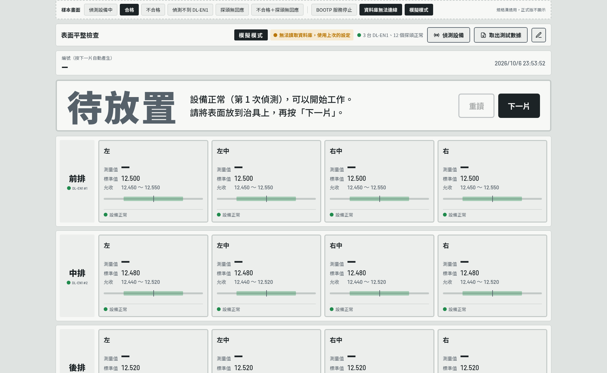
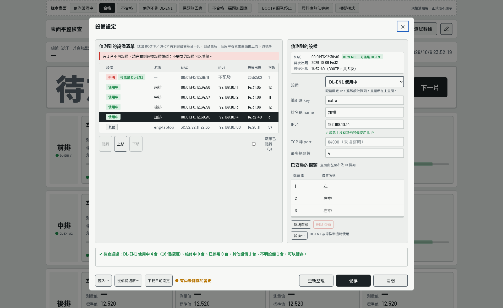
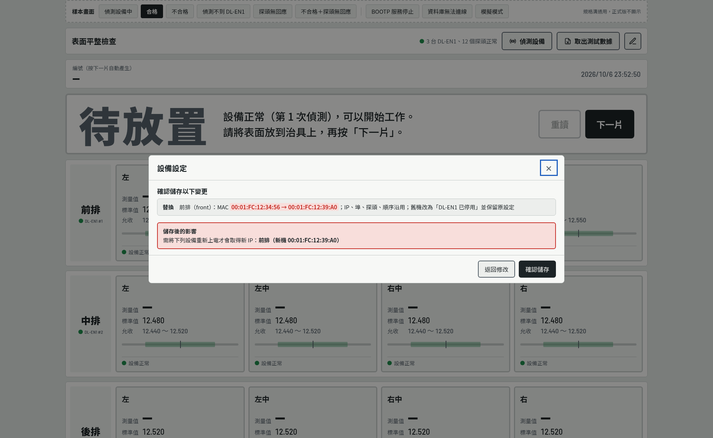
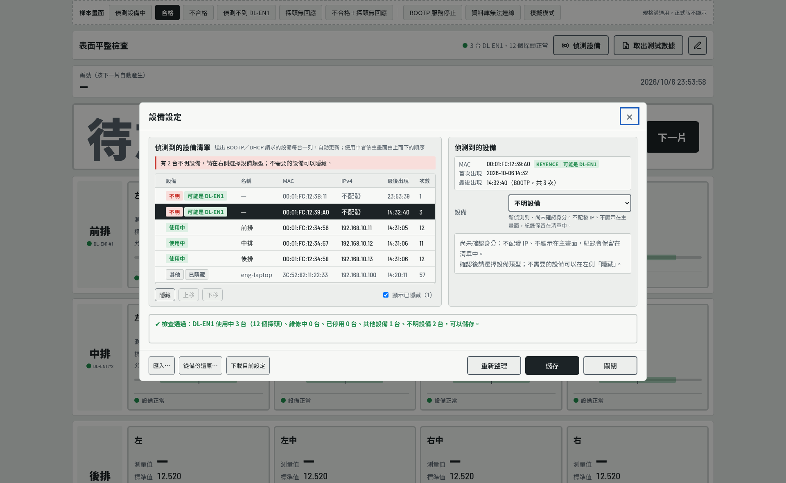

# 表面平整檢查 作業員畫面設計規格

> 依據：`Downloads/表面平整檢查系統_需求規格書.md`（2026-10-06 修訂版）3.4 UI、3.8 UPL、3.10 DSC、SIM-14
> 原型：[`prototype/board-station.html`](prototype/board-station.html)（以瀏覽器開啟即可操作）

本文件把畫面原型的版面、顏色、字型、元件與狀態轉成文字，供開發實作。畫面上的排與探頭依資料庫中「DL-EN1 使用中」的設備動態產生（需求規格書 3.7、3.10）。數值以原型為準；原型中最上方的「樣本畫面」切換列（含 BOOTP 服務停止、資料庫無法連線、模擬模式三個系統狀態切換）只供展示，正式版不實作。

---

## 1. 目標裝置與設計原則

| 項目 | 規格 |
| --- | --- |
| 解析度 | 1920 × 1080，全螢幕（無視窗標題列） |
| 觀看距離 | 作業員站立，距螢幕 1～2 公尺 |
| 語系 | 繁體中文；字型必須離線可用（不可依賴網路字型） |
| 操作 | 觸控或滑鼠；作業員只使用「重讀」「下一片」兩顆大按鍵 |

設計原則：

1. **結果優先**：結果橫幅是全畫面最醒目的元素，一眼即可判斷能否放行。
2. **不只靠顏色**：合格、偏高、偏低、異常各有不同形狀的圖示與文字，色弱也能分辨。
3. **非合格一律紅色並標 FAIL**：超出規格與設備異常都用紅色，以文字與圖示區分原因。
4. **錯誤點最醒目**：不合格時，問題點加粗紅框，合格點淡化。
5. **不可誤導**：資料不完整或設備異常時絕不顯示綠色合格。

---

## 2. 色彩

預設使用淺色主題。深色主題為選配（原型依系統設定自動切換），產線若無需求可不實作。

| 代號 | 淺色 | 深色 | 用途 |
| --- | --- | --- | --- |
| `bg` | `#DFE3E1` | `#171C1F` | 頁面背景 |
| `panel` | `#F7F8F6` | `#222A2E` | 工具列、編號列、排容器、對話框背景 |
| `panel-2` | `#ECEEEC` | `#1C2327` | 探頭方塊、排名稱底色、輸入框、次要按鍵 |
| `ink` | `#1C2326` | `#E7ECEE` | 主要文字、測量值、刻度指標 |
| `ink-2` | `#56616A` | `#9AA6AD` | 次要文字、標籤、次要按鍵邊框 |
| `line` | `#C3C9C7` | `#38434A` | 一般邊框、刻度底線、分隔線 |
| `go` | `#1F8A4C` | `#3FBF74` | 合格（文字、圖示、邊框、按鍵、允收區間） |
| `go-soft` | `#DCEFE3` | `#173A27` | 合格橫幅背景 |
| `ng` | `#C8322B` | `#FF6259` | 不合格與設備異常（文字、圖示、邊框、按鍵） |
| `ng-soft` | `#F8DEDB` | `#46201E` | 不合格、異常的背景 |
| `warn` | `#B87400` | `#F0A93A` | 「有尚未儲存的變更」、「無法讀取資料庫」提示、「維修中」標籤 |
| `warn-soft` | `#F6EAD2` | `#3D3018` | 「無法讀取資料庫」提示與「維修中」標籤的背景 |
| `stale` | `#8A9296` | `#7C878D` | 未知狀態的指示點 |
| `focus` | `#1F5FBF` | `#6AA2FF` | 鍵盤焦點外框（3px，外距 2px） |
| 白色 | `#FFFFFF` | `#FFFFFF` | 實心按鍵文字、圖示內的符號 |

---

## 3. 字型

| 代號 | 字型堆疊 | 用途 |
| --- | --- | --- |
| 文字字型 | Noto Sans TC → Noto Sans CJK TC → PingFang TC → Microsoft JhengHei → sans-serif | 所有中文與一般文字 |
| 數字字型 | Barlow Semi Condensed → 文字字型 | 編號、時間、測量值、標準值、允收範圍、倒數秒數 |

- Ubuntu 上以 `fonts-noto-cjk` 提供 Noto Sans CJK TC；Barlow Semi Condensed（SIL OFL）隨 App 附帶字型檔，以 `QFontDatabase.addApplicationFont()` 載入。
- 所有數字使用**等寬數字**（tabular figures），數值變動時不跳動。
- 字重：400 一般、500 中等、700 粗、900 特粗（結果大字、排名稱、狀態徽章）。

---

## 4. 整體版面

```
┌──────────────────────────────────────────────────────────────────────┐
│ ① 頂端工具列  表面平整檢查   ● 設備狀態摘要  [偵測設備] [取出測試數據] [✎] │
├──────────────────────────────────────────────────────────────────────┤
│ ② 編號列      編號（按下一片自動產生）                    2026/10/06 14:32 │
│               20261006143208123  重讀 1 次                              │
├──────────────────────────────────────────────────────────────────────┤
│ ③ 結果橫幅  [圖示] 合格        12 個量測點都在標準範圍內。   [重讀][下一片] │
│                   PASS        送往下一站……                              │
├──────────────────────────────────────────────────────────────────────┤
│ ④ 排       ┌────┬────────┬────────┬────────┬────────┐                   │
│            │前排│ 探頭方塊 │ 探頭方塊 │ 探頭方塊 │ 探頭方塊 │                   │
│            │#1  │         │         │         │         │                   │
│            └────┴────────┴────────┴────────┴────────┘                   │
│            （每台 DL-EN1 一排，依位置第 1～10 排由上而下）                        │
└──────────────────────────────────────────────────────────────────────┘
```

| 項目 | 規格 |
| --- | --- |
| 內容寬度 | 整個螢幕寬度（左右各 16px 邊距）（UI-11） |
| 自動縮放（UI-11） | 排、探頭方塊與結果橫幅依螢幕大小以同一比例 k 縮放（字級、內距、圖示、刻度條；字級最小 12px）：取最大的 k，使全部的排（多於 4 排時至少前 4 排）不需捲動即可看到；設備少時 k 最大為 1。橫幅縮放比例為 0.4 + 0.6k，高度固定為 190px × 比例，狀態改變時排的大小不跳動；方塊高度也不隨結果改變（徽章、註記、刻度條預留位置）。1920 × 1080 下 4 排 × 4 點約為 k = 0.6 |
| 外距 | 左右 16px、下 16px |
| 區塊間距 | 14px（①～④之間）；排與排之間 12px |
| 圓角 | 一般 6px；結果橫幅與大按鍵 8px；小元素 3～4px |

**排與探頭的數量由 DL-EN1 定義檔決定**：每台 DL-EN1 一排，依位置標籤 `key`（第 1～10 排，EDT-05）由上而下、沒有設備的排號略過，排名稱取 `name`；每排只顯示已安裝的探頭，依 `id` 由左至右，位置名稱取 `description`。探頭區欄數 ＝ 已安裝探頭數，但最少 4 欄、最多 6 欄（少於 4 個時方塊維持 4 欄的寬度，超過 6 個時換行）。定義檔套用後畫面立即重建。

---

## 5. 元件規格

### 5.1 頂端工具列

| 項目 | 規格 |
| --- | --- |
| 容器 | 背景 `panel`，邊框 1px `line`，圓角 6px，內距 10px 16px，橫向排列、垂直置中、間距 12px |
| 標題 | 「表面平整檢查」，20px，粗體 700，靠左，其餘元素靠右 |
| 設備狀態摘要 | 指示點（12px 圓點）+ 文字 15px `ink-2` |
| 工具按鍵 | 「偵測設備」「取出測試數據」：17px 粗體，內距 10px 18px，邊框 2px `ink-2`，背景 `panel-2`，圓角 6px，左側 20px 線條圖示，圖示與文字間距 8px |
| 系統狀態提示 | 設備狀態摘要左側，有狀況時才顯示，間距 8px；15px 粗體、內距 5px 10px、圓角 4px：「BOOTP 服務停止，自動重新啟動中」（`ng-soft` 底、`ng` 字、`ng` 指示點，DSC-07）、「無法讀取資料庫，使用上次的設定」（`warn-soft` 底、`warn` 字、`warn` 指示點，DSC-06）；模擬模式時最左側顯示「模擬模式」（`ink` 底、`panel` 字、17px、字距 0.15em，SIM-14） |
| 設備設定按鍵 | 最右側，46 × 46px 正方形，只有 22px 鉛筆圖示，邊框 2px `ink-2`，背景 `panel-2`，圓角 6px；提示文字「設備設定」；點擊開啟 5.10 對話框 |
| 停用規則 | 倒數、讀取中、偵測中，三顆工具按鍵與編輯按鍵皆停用（透明度 35%） |



設備狀態摘要的內容：

| 狀態 | 指示點 | 文字 |
| --- | --- | --- |
| 偵測中 | `ink-2`，1 秒閃爍 | 偵測設備中（第 N 次） |
| 全部正常 | `go` | N 台 DL-EN1、M 個探頭正常（N、M 依定義檔計算） |
| 有異常 | `ng` | N 個量測點異常（文字 `ng`、粗體） |

### 5.2 編號列

| 項目 | 規格 |
| --- | --- |
| 容器 | 背景 `panel`，邊框 1px `line`，圓角 6px，內距 12px 18px |
| 標籤 | 「編號（按下一片自動產生）」，14px `ink-2` |
| 編號 | 17 碼，數字字型 32px 粗體，字距 0.03em；尚未產生時顯示「—」 |
| 重讀次數 | 編號右側 6px，15px `ink-2`，「重讀 N 次」，0 次時不顯示 |
| 時間 | 靠右，數字字型 20px `ink-2`，每秒更新，格式 `YYYY/M/D HH:mm:ss` |

### 5.3 結果橫幅

容器：三欄格線（左：圖示與大字｜中：說明文字，填滿｜右：按鍵），欄距 36px，內距 22px 32px，邊框 4px，圓角 8px。

| 部位 | 規格 |
| --- | --- |
| 圖示 | 110 × 110px（窄螢幕最小 64px），與大字間距 20px |
| 大字 | 112px（窄螢幕最小 56px），特粗 900，字距 0.05em；下方英文小字為大字的 0.36 倍，數字字型，字距 0.12em，上距 6px |
| 大字（長字詞） | 「設備異常」「偵測設備中」使用 84px |
| 倒數數字 | 數字字型 112px 粗體，置中 |
| 說明文字 | 28px（最小 20px），中等 500，行高 1.5；重點以特粗 900 |
| 重新偵測提示 | 說明文字第三行，0.9 倍字級，`ink-2` |
| 按鍵 | 「重讀」在左、「下一片」在右，間距 12px |

**橫幅狀態**

| 狀態 | 背景／邊框 | 圖示 | 大字／英文 | 說明文字 | 重讀 | 下一片 |
| --- | --- | --- | --- | --- | --- | --- |
| 待放置 | `panel`／`line` | 無 | 待放置（`ink-2`） | 設備正常（第 N 次偵測），可以開始工作。請將表面放到治具上，再按「下一片」。 | 停用 | 可按 |
| 偵測設備中 | `panel`／`line` | 偵測圖示，`ink-2`，每 1.6 秒旋轉一圈 | 偵測設備中（`ink-2`） | 第 N 次偵測／正在檢查 N 台 DL-EN1 與 M 個探頭…／全部正常後即可開始工作。 | 停用 | 停用 |
| 設備啟動中 | `panel`／`line` | 偵測圖示旋轉 | 設備啟動中 | DL-EN1 啟動中，自動重試 | 停用 | 停用 |
| 倒數 | `panel`／`line` | 無 | 倒數數字 5→1 | 請勿移動表面／N 秒後自動讀取探頭數值 | 停用 | 停用 |
| 讀取中 | `panel`／`line` | 無 | 讀取中（`ink-2`） | 正在讀取 M 個探頭… | 停用 | 停用 |
| 合格 | `go-soft`／`go` | 合格圖示（`go`） | 合格／PASS（`go`） | M 個量測點都在標準範圍內。送往下一站，放上新的一片後按「下一片」。 | 可按 | 可按（`go` 實心） |
| 不合格 | `ng-soft`／`ng` | 不合格圖示（`ng`） | 不合格／FAIL（`ng`） | **中排 右中偏高、後排 左偏低**／懷疑沒放好可重新放置後按「重讀」；確認不良請放到不良品區，放上新的一片後按「下一片」。 | 可按 | 可按（`ng` 實心） |
| 設備異常 | `ng-soft`／`ng` | 異常圖示（`ng`） | 設備異常／FAIL（`ng`） | **中排 DL-EN1 偵測不到**、**後排 右探頭無回應（感測頭錯誤（ErH））**、**設備 4 有 4 個探頭未設定允收標準**（未設定允收標準以每台合併一句；另有超出規格時加一行「另有：…」）／請通知工程人員；排除後自動恢復。／已偵測 N 次，X 秒後自動重新偵測 | 停用 | 停用 |

**橫幅按鍵**

| 按鍵 | 規格 |
| --- | --- |
| 共通 | 24px 粗體，內距 18px 30px，圓角 8px |
| 下一片（主要） | 實心，白字；背景：合格 `go`、不合格與設備異常 `ng`、其他狀態 `ink` |
| 重讀（次要） | 背景 `panel`，文字 `ink`，邊框 3px `ink-2`；滑過時邊框 `ink` |
| 停用 | 透明度 35%，游標為禁止 |

### 5.4 排

| 項目 | 規格 |
| --- | --- |
| 容器 | 兩欄格線：左欄 110px（排名稱）、右欄探頭區；背景 `panel`，邊框 1px `line`，圓角 6px，內距 12px，欄距 12px |
| 排名稱 | 26px 特粗 900，置中，背景 `panel-2`，圓角 4px；下方 6px 為 DL-EN1 標示：12px 數字字型 `ink-2`，前置 12px 指示點，例「● DL-EN1 #2」 |
| 探頭區 | 等寬格線，探頭方塊間距 10px |
| DL-EN1 偵測不到 | 容器邊框改 4px `ng`；排名稱背景 `ng-soft`、文字 `ng`；DL-EN1 標示改為紅底白字小標籤（內距 2px 8px，圓角 3px）「DL-EN1 #2／偵測不到」 |
| DL-EN1 維修中（DSC-15） | 保留該排、位置不變；排名稱文字 `ink-2`；DL-EN1 標示改為 `warn-soft` 底 `warn` 字小標籤「DL-EN1 #2／維修中」；探頭區改為單一灰色虛線框（2px `line`，背景 `panel-2`），置中 22px 粗體 `ink-2`「維修中：不連線、不量測（N 個探頭）」；不列入偵測、量測、判定與狀態摘要的台數 |

### 5.5 探頭方塊

結構由上而下：

```
┌──────────────────────────────────────────┐
│ 位置名稱                            ✔ 合格 │  ← 標題列：位置名稱 + 狀態徽章（位置固定）
│ 測量值  12.503 mm          標準值 12.500   │  ← 數值區：左為測量值（大字），右為標準值與允收
│                             允收 12.450～12.550│
│ ───[▒▒▒▒▒│▒▒▒▒]───  ▼                     │  ← 刻度條
│ ─────────────────────────────────────────│
│ ● 設備正常                 超出上限 0.017 │  ← 設備狀態列；註記在右側（只在不合格或異常時）
└──────────────────────────────────────────┘
```

| 部位 | 規格 |
| --- | --- |
| 容器 | 背景 `panel-2`，邊框 3px `line`，圓角 6px，內距 12px 14px，元素間距 8px |
| 位置名稱 | 20px 粗體 |
| 狀態徽章 | 36px 圖示 + 文字 22px 特粗，間距 6px |
| 數值區 | 兩列高：左側「測量值」標籤＋測量值（跨兩列、垂直置中，預留「-88.888 mm」寬度）；右側「標準值」「允收」標籤（靠右）＋數值。標籤 15px `ink-2`，間距 10px，列距 2px（UI-11） |
| 測量值 | 數字字型 44px（最小 32px）粗體，小數 3 位；單位「mm」為 0.42 倍、中等、`ink-2`，左距 3px |
| 標準值 | 數字字型 22px |
| 允收範圍 | 數字字型 18px `ink-2`，格式「下限 ～ 上限」 |
| 註記 | 18px 粗體 `ng`，位於設備狀態列右側：「超出上限 0.017」「低於下限 0.012」或異常原因（例：感測頭錯誤（ErH））；與設備狀態文字相同時不重複顯示 |
| 設備狀態列 | 上方 1px `line` 分隔線，上內距 6px；12px 指示點 + 14px 文字 `ink-2` |

**探頭方塊狀態**

| 狀態 | 邊框 | 背景 | 徽章 | 測量值 | 刻度指標 | 設備狀態列 |
| --- | --- | --- | --- | --- | --- | --- |
| 空白（倒數、讀取中） | 3px `line` | `panel-2` | 隱藏 | 「—」 | 隱藏 | 依偵測結果 |
| 偵測中 | 3px `line` | `panel-2` | 隱藏 | 「—」 | 隱藏 | `ink-2` 閃爍點「偵測中…」 |
| 合格 | 3px `go` | `panel-2` | 合格圖示「合格」（`go`） | `ink` | `ink` | `go` 點「設備正常」 |
| 偏高 | **5px `ng`** | `ng-soft` | 偏高圖示「偏高」（`ng`） | `ng` | `ng` | `go` 點「設備正常」 |
| 偏低 | **5px `ng`** | `ng-soft` | 偏低圖示「偏低」（`ng`） | `ng` | `ng` | `go` 點「設備正常」 |
| 設備異常 | **5px `ng`** | `ng-soft` | 異常圖示「異常」（`ng`） | 「無數據」，文字字型 26px 特粗 `ng` | 刻度條隱藏 | `ng` 點，粗體：「DL-EN1 偵測不到」「探頭無回應」或「未設定允收標準」；註記寫具體原因 |

未設定允收標準的探頭：標準值顯示「—」、允收顯示「未設定」，量測時一律為設備異常，不得判為合格。

**淡化規則**：整片判定為不合格或設備異常時，所有「合格」方塊透明度降為 55%，讓問題點最醒目。

### 5.6 刻度條

高 34px，以百分比定位：

| 部位 | 規格 |
| --- | --- |
| 底線 | 全寬，距頂 14px，高 6px，`line`，圓角 3px |
| 允收區間 | 左 20%～右 80%（佔中間 60%），距頂 10px，高 14px，`go` 透明度 35%，圓角 2px |
| 標準值線 | 50% 位置，距頂 7px，寬 2px、高 20px，`ink-2` |
| 測量值指標 | 向下三角形，寬 18px、高 13px，尖端朝下，顏色同測量值 |

指標水平位置：

```
區間寬 = (上限 − 下限) ÷ 0.6
起點   = 下限 − 區間寬 × 0.2
位置%  = (測量值 − 起點) ÷ 區間寬 × 100，限制在 2%～98%
```

註：標準值線固定畫在 50%，標準值不在上下限正中央時與實際位置略有偏差，原型即如此處理。

### 5.7 指示點

12 × 12px 圓點：`go` 正常、`ng` 異常、`stale` 未知、`ink-2` 閃爍為偵測中（每 1 秒在 100% 與 20% 透明度之間變化）。

### 5.8 取出測試數據對話框

| 項目 | 規格 |
| --- | --- |
| 容器 | 寬 460px（最大 92% 螢幕寬），背景 `panel`，邊框 1px `line`，圓角 8px，內距 20px 22px，元素間距 14px；背景遮罩黑色 45%；置於主畫面中央（UI-09） |
| 標題 | 「取出測試數據」，20px |
| 日期 | 標籤「日期」15px `ink-2`；日期輸入框：數字字型 20px，內距 8px 10px，邊框 2px `line`，背景 `panel-2`；預設今天 |
| 資訊框 | 背景 `panel-2`，圓角 4px，內距 10px 12px，16px，行高 1.6：「該日共 **N** 筆紀錄／預設檔名：平整檢查_YYYY-MM-DD.xlsx」；無紀錄時「該日沒有紀錄，不會產生檔案。」 |
| 按鍵 | 靠右，間距 10px：「取消」（次要）、「選擇位置並儲存」（主要：背景 `ink`、文字 `panel`）；17px，內距 10px 18px，邊框 2px，圓角 6px；無紀錄時主要按鍵停用 |

### 5.9 提示訊息（Toast）

畫面底部置中、距底 24px；背景 `ink`、文字 `panel`，16px，內距 12px 20px，圓角 6px；淡入 0.2 秒，顯示 3.2 秒後淡出。用於「編號 … 已寫入資料庫」等非阻斷訊息。


### 5.10 設備設定對話框

由頂端工具列的鉛筆按鍵開啟，用來檢視設備網路上送出 BOOTP／DHCP 請求的設備、決定每台的設備類型，並編輯 DL-EN1 設定（需求規格書 3.10 DSC、3.8 UPL）。資料來自資料表 `lan_device`（DL-EN1 設定的主檔）；設備與其 MAC 一律來自偵測（或匯入定義檔），**不提供手動新增或輸入 MAC**。對話框分三個步驟：密碼 → 編輯（清單 ＋ 內容兩欄式）→ 確認儲存。

**容器**

| 項目 | 規格 |
| --- | --- |
| 尺寸 | 密碼步驟：寬 560px 的小視窗，置於主畫面中央（UI-09）；編輯與確認儲存步驟：佔滿主畫面（UI-10），主畫面改變大小時跟著調整；模態 |
| 結構 | 標題列（固定）／內容區（可捲動）／按鍵列（固定） |
| 標題列 | 「設備設定」20px；右側「✕」關閉鍵（22px，`ink-2`）；下方 1px `line` 分隔線；內距 16px 22px |
| 內容區 | 內距 16px 22px，區塊間距 18px；區塊標題 17px 粗體，右側可接 13px `ink-2` 說明 |
| 按鍵列 | 上方 1px `line` 分隔線，內距 14px 22px；左側為次要功能，右側為主要按鍵 |
| 按鍵樣式 | 一般：16px，內距 9px 16px，邊框 2px `ink-2`，背景 `panel-2`，圓角 6px；主要：背景 `ink`、文字 `panel`；危險：邊框與文字 `ng`、背景 `panel`；小型：14px，內距 5px 10px，邊框 1px；停用透明度 35% |
| 輸入框 | 16px，內距 6px 8px，邊框 2px `line`，背景 `panel`，圓角 4px；數值、MAC、IP 用數字字型 17px；錯誤時邊框 `ng`、背景 `ng-soft` |

**步驟一：密碼**（UPL-01）

- 「工程人員密碼」密碼輸入框（最寬 360px），下方 13px `ink-2` 說明：「此功能會變更 DL-EN1 的 IP 配發與畫面配置，限工程人員使用。」
- 按鍵：「取消」「確認」。未輸入時輸入框標紅，不進入下一步。

**步驟二：編輯（偵測到的設備清單 ＋ 偵測到的設備 兩欄式）**

對話框此步驟佔滿主畫面（UI-10）。



```
┌ 偵測到的設備清單（送出 BOOTP／DHCP 請求的設備每台一列，自動更新）──────┐ ┌ 偵測到的設備 ─────────────────────────┐
│ 有 1 台不明設備，請在右側選擇設備類型；不需要的設備可以隱藏。            │ │ MAC       00:01:FC:12:39:A0 [KEYENCE｜可能是 DL-EN1] │
│ ✘│設備                 │名稱      │MAC              │IPv4     │最後出現│次數│ │ 首次出現  2026-10-06 14:32               │
│  │[不明][可能是 DL-EN1]│—         │00:01:FC:12:39:A0│不配發    │14:32:40│ 3 │ │ 最後出現  14:32:40（BOOTP，共 3 次）      │
│  │[使用中]             │前排      │00:01:FC:12:34:56│…10.11   │14:31:05│12 │ │ 設備      [DL-EN1 使用中            ▾]   │
│  │[使用中]             │中排      │00:01:FC:12:34:57│…10.12   │14:31:06│11 │ │ 位置（第 N 排）／排名稱 name／IPv4（檢查結果）│
│  │[其他]               │eng-laptop│3C:52:82:11:22:33│…10.100  │14:20:11│57 │ │ TCP 埠 port／探頭數量                   │
│ [隱藏] [上移] [下移] [刪除]                     □ 顯示已隱藏（0）        │ │ 已安裝的探頭  [新增探頭] [刪除探頭]       │
└──────────────────────────────────────────────────────────────────────┘ │ [替換…] DL-EN1 故障換新機時使用          │
                                                                           └────────────────────────────────────────┘
┌ 檢查訊息 ──────────────────────────────────────────────────────────────────────────────────────────┐
│ ✔ 檢查通過：DL-EN1 使用中 3 台（12 個探頭）、維修中 0 台、已停用 0 台、其他設備 1 台、不明設備 1 台，可以儲存。 │
└────────────────────────────────────────────────────────────────────────────────────────────────────┘
[匯入…] [從備份還原…] [下載目前設定]  ● 有尚未儲存的變更              [重新整理] [ 儲存 ] [ 關閉 ]
```

**設備類型（右欄「設備」下拉選單；需求規格書 3.10 狀態表）**

| 選項 | 代碼 | 清單標籤 | 說明（顯示在下拉選單下方，13px `ink-2`） | IP 配發 | 主畫面 | 可設定 |
| --- | --- | --- | --- | --- | --- | --- |
| 不明設備 | `unclassified` | 紅底紅字「不明」 | 新偵測到、尚未確認身分。不配發 IP、不顯示在主畫面，紀錄保留在清單中。 | 否 | 不顯示 | 無 |
| DL-EN1 使用中 | `dl_en1_live` | 綠底綠字「使用中」 | 配發固定 IP，連線讀取探頭，並顯示在主畫面。 | 是 | 顯示 | 完整 DL-EN1 設定 |
| DL-EN1 維修中 | `dl_en1_maint` | 橘底橘字「維修中」 | 暫時不使用（例如送修）。主畫面保留該排並標示「維修中」，但不連線、不量測、不影響判定；保留設定與 IP 配發，key、名稱與 IP 仍保留給它。 | 是 | 顯示（灰色，不量測） | 完整 DL-EN1 設定 |
| DL-EN1 已停用 | `dl_en1_retired` | 灰底灰字「已停用」 | 已不再使用。不配發 IP、不顯示在主畫面；保留最後的設定供查詢，位置、名稱與 IP 讓給其他設備。 | 否 | 不顯示 | 無（唯讀顯示最後設定） |
| 其他設備 | `not_dl_en1` | 灰底灰字「其他」 | 不是 DL-EN1 的設備（例如協同合作設備、筆電）。只能設定 IP，留空表示不配發。 | 有設定時 | 不顯示 | 只有 IPv4 |

- 選擇「DL-EN1 使用中」或「維修中」：顯示位置、排名稱、IPv4、TCP 埠、探頭數量與已安裝的探頭；第一次設為 DL-EN1 時預先帶入探頭數量 4、探頭 1～4（左、左中、右中、右）。
- 選擇「其他設備」：只顯示 IPv4 欄位與說明框「只能設定 IP。若它其實是 DL-EN1，請將「設備」改為「DL-EN1 使用中」。」
- 選擇「DL-EN1 已停用」：唯讀說明框列出最後的位置、名稱、IP、探頭數，並說明「改回使用中或維修中會帶回這些設定，並重新檢查是否與現有設備重複」（DSC-09）。
- 選擇「不明設備」：說明框「尚未確認身分：不配發 IP、不顯示在主畫面，紀錄會保留在清單中。確認後請選擇設備類型；不需要的設備可以在左側「隱藏」。」
- 下拉選單：16px 粗體，邊框 2px `ink-2`。

**各部位**

| 部位 | 規格 |
| --- | --- |
| 兩欄 | 左「偵測到的設備清單」與右「偵測到的設備」寬度比 1.55 : 1，間距 16px；每欄為面板（背景 `panel-2`，邊框 1px `line`，圓角 6px，內距 12px 14px） |
| 清單表格 | 容器背景 `panel`，邊框 1px `line`，高 270px 可捲動，表頭固定；欄位：錯誤標記、設備（類型標籤；已隱藏者另加灰框「已隱藏」；不明設備且 MAC 前綴為 KEYENCE `00:01:FC` 者另加綠底「可能是 DL-EN1」）、名稱（DL-EN1 為排名稱、其他設備為主機名稱，無則「—」）、MAC、IPv4（不配發者顯示「不配發」）、最後出現、次數；非 DL-EN1 的列文字 `ink-2` |
| 清單排序 | 所有設備共用一個順序，以上移／下移調整（DSC-17），只影響本清單，不影響主畫面（主畫面依位置，EDT-05）；名稱欄顯示「第 N 排・排名稱」；新偵測到、尚未排序的不明設備在最上面（DSC-02） |
| 清單列狀態 | 點擊列即選取；選取列背景 `ink`、文字 `panel`；有錯誤的列首欄顯示「✘」，未選取時整列文字 `ng` |
| 自動更新 | 探索到新設備時，清單即時加入（不明設備），並以提示訊息「偵測到 N 台新設備，已以「不明設備」加入清單」通知；「重新整理」可手動更新 |
| 清單按鍵 | 「隱藏／取消隱藏」（DL-EN1 使用中、維修中時停用）、「上移」「下移」（任何設備皆可；選取的設備在最上面時「上移」停用、最下面時「下移」停用，其餘兩鍵皆可用；只影響本清單，主畫面依位置標籤 EDT-05；按下即儲存，提示「已儲存順序：…」，App 重新啟動後不變，DSC-17）、「刪除」（小按鍵，`ng` 字與框；任何設備皆可；按下後以警告訊息框確認，按鍵「取消」「刪除」，預設「取消」；確認後立即刪除並提示「已刪除 …」；刪除最後一台使用中時確認訊息另加警告「刪除後主畫面沒有可量測的設備」，DSC-18）；右側核取方塊「顯示已隱藏（N）」。**不提供新增**（DSC-16） |
| 隱藏（DSC-13） | 只影響清單顯示，按下即生效、寫入資料庫、不需儲存；狀態、IP 配發與探索不受影響；不明設備再次出現時自動取消隱藏；設為 DL-EN1 使用中或維修中時自動取消隱藏 |
| 設備資訊 | 右欄最上方唯讀框（背景 `panel`，邊框 1px `line`）：MAC（KEYENCE 者另加綠底「KEYENCE｜可能是 DL-EN1」）、首次出現、最後出現（含請求類型與次數）、主機名稱（DHCP 才有） |
| 內容表單 | 兩欄表單：標籤欄 120px（15px `ink-2`）＋輸入框；欄位依序：設備、位置（下拉選單「請選擇」＋「第 1 排」～「第 10 排」；已被其他使用中／維修中設備佔用的排以 `ink-2` 標示「（已由 {排名稱} 使用）」且不可選；第一次設為 DL-EN1 時預設最小的空排，EDT-05）、排名稱 name、IPv4、TCP 埠 port、探頭數量；空白時顯示淡色提示字 |
| IPv4 預設值（DSC-08） | 設為 DL-EN1 使用中／維修中或其他設備而 IP 為空時，自動帶入設備網段中該類型範圍內最小的未佔用位址：DL-EN1 `.11～.99`、其他設備 `.100～.199`（範圍可設定；範圍滿了改取網段內其他位址） |
| IPv4 檢查（DSC-08、DSC-10） | 欄位下方 13px 檢查結果：離開欄位後自動以 ARP 探測，期間顯示「檢查中…（ARP 探測）」（`ink-2`）；通過顯示「✔ 網路上沒有其他設備使用此 IP」（`go`）；被資料表中其他設備佔用顯示「已由 {狀態} {MAC}（{名稱}）使用」、被網路上其他 MAC 回應顯示「網路上已有設備使用此 IP（MAC …）」（`warn` 粗體，只提示不阻擋儲存；檢查訊息列出「⚠ …（仍可儲存）」，確認儲存頁列出可能的 IP 衝突）；替換時舊機仍回應原 IP 只提示「舊機 … 仍在線上，請拔除後再為新機上電」，不阻擋；IP 未變更者顯示「使用中的 IP，未變更」 |
| 已安裝的探頭 | 表格高 180px 可捲動；欄位「探頭 ID」（110px，數字字型，自動編號 1～N、不可編輯）、「位置名稱」（可直接編輯）；筆數跟著「探頭數量」增減（新增者預設「探頭 N」）；點選列即選取並啟用「刪除探頭」；「刪除探頭」後後面的 ID 往前遞補；「新增探頭」等同數量加 1（EDT-06） |
| 替換（DSC-14） | 只在「DL-EN1 使用中」顯示「替換…」（說明「DL-EN1 故障換新機時使用」）；按下後展開替換區（邊框 2px `ink-2`）：新機下拉選單只列出偵測到的不明設備、其他設備、已停用設備，KEYENCE 優先、最近出現的在前；說明「新機取得此台全部設定（key、名稱、IP、埠、探頭、順序）並設為使用中；此台改為「DL-EN1 已停用」並保留原設定。新機須先上電讓系統偵測到。」；按鍵「確認替換」「取消」 |
| 檢查訊息區 | 全寬，背景 `panel`，邊框 2px（有錯誤 `ng`、無錯誤 `line`），高 72～140px 可捲動；每則「✘ 設備名稱 › 欄位：訊息」（無名稱時以 MAC 代替），點擊可跳到該台（已隱藏者自動顯示已隱藏）；無錯誤時顯示綠色粗體「✔ 檢查通過：DL-EN1 使用中 N 台（M 個探頭）、維修中 N 台、已停用 N 台、其他設備 N 台、不明設備 N 台，可以儲存。」 |
| 即時檢查 | 每次輸入即重新檢查；輸入中不重建表單 |
| 未儲存提示 | 按鍵列左側；有修改時顯示 `warn` 圓點＋粗體「有尚未儲存的變更」（`warn`） |
| 按鍵列左側 | 小型按鍵「匯入…」（選擇定義檔，經差異預覽後寫入資料庫：檔案中的 DL-EN1 設為使用中，原本使用中但不在檔案內者設為已停用）、「從備份還原…」（列出最近 20 份備份與時間）、「下載目前設定」（另存為定義檔格式） |
| 按鍵列右側 | 三顆等寬按鍵（各 132px，間距 10px）：「重新整理」、「儲存」（主要按鍵，有尚未儲存的變更即可按，與偵測無關（EDT-04）；設定有錯時左側以 `ng` 粗體顯示「✘ 有 N 項錯誤，儲存前須修正　查看」，按下則跳出訊息列出錯誤、選取第一個有錯誤的設備、不進入步驟三；無錯誤時按下進入步驟三）、「關閉」（有未儲存變更時先確認） |

檢查規則（需求規格書 3.7.1、DSC-08～DSC-11）：

- **DL-EN1 使用中**：至少 1 台、最多 8 台。
- **DL-EN1 使用中、維修中**：位置須為第 1～10 排其中一排；name 1～10 字；Port 空白或 1～65535；探頭數量 1～15（等於清單筆數，EDT-06）；至少 1 個探頭；探頭 ID 自動為 1～探頭數量；位置名稱 1～10 字。
- **不可重複**：位置（每排一台）、name 在 DL-EN1 使用中與維修中之間；IPv4 在所有會配發 IP 的設備（使用中、維修中、設有 IP 的其他設備）之間。已停用者不佔用。
- **IPv4**：格式正確、在設備網段、非網路／廣播位址、不同於量測 PC；新設定或變更的 IP 須通過 ARP 探測。

**步驟三：確認儲存（按「儲存」後）**



| 部位 | 規格 |
| --- | --- |
| 變更清單 | 每項一個區塊（背景 `panel-2`，邊框 1px `line`，圓角 6px，內距 10px 14px，15px，行高 1.6）；開頭標示「替換」「變更」「順序」；狀態變更、MAC 與 IP 的變更以紅底紅字粗體標示 |
| 變更比對 | 以 MAC 對應新舊資料；比對狀態、IP、key、排名稱、Port、探頭數量、探頭新增／移除／改名、主畫面排列順序；替換以一項呈現「{名稱}（{key}）：MAC 舊 → 新；IP、埠、探頭、順序沿用；舊機改為「DL-EN1 已停用」並保留原設定」 |
| 影響區塊 | 紅框紅底：「需將下列設備重新上電才會取得新 IP」（新配發或 IP 變更者，替換時為新機）、「下列探頭尚未設定允收標準，量測時將顯示設備異常」、「下列量測點將從主畫面移除」 |
| 未寫入的結果 | 畫面上有尚未寫入的量測結果時，顯示說明框「畫面上編號 … 的量測結果會先寫入資料庫，再套用設定。」（UPL-02） |
| 按鍵 | 「返回修改」、「確認儲存」（無任何變更時停用） |

**儲存後**：先寫入畫面上尚未寫入的量測結果（UPL-02）→ 關閉對話框 → 寫入資料庫、產生定義檔與 BOOTP 對應、由 App 重新啟動 dnsmasq（失敗時資料庫與檔案皆還原）→ 清除目前編號與重讀次數 → 依新設定重建主畫面 → 自動執行偵測設備；提示訊息「編號 … 已寫入資料庫；已儲存設定並更新 BOOTP 對應；請將 … 重新上電」。



---

## 6. 圖示

全部為 SVG，以 `currentColor` 上色，圖示內的符號固定白色。

| 名稱 | 用途 | 形狀 |
| --- | --- | --- |
| 合格 | 合格徽章、合格橫幅 | 實心圓 + 打勾 |
| 不合格 | 不合格橫幅 | 實心圓 + 叉 |
| 偏高 | 偏高徽章 | 尖端朝上的實心三角形 + 向上箭頭 |
| 偏低 | 偏低徽章 | 尖端朝下的實心三角形 + 向下箭頭 |
| 異常 | 設備異常徽章與橫幅 | 圓角實心方形 + 驚嘆號 |
| 偵測 | 「偵測設備」按鍵、偵測中橫幅 | 線條：中心圓 + 兩側弧形訊號 |
| Excel | 「取出測試數據」按鍵 | 線條：文件 + 叉 |
| 編輯 | 設備設定按鍵 | 線條：鉛筆 |

```xml
<!-- 合格 -->
<svg viewBox="0 0 32 32"><circle cx="16" cy="16" r="15" fill="currentColor"/><path d="M9 16.5l4.5 4.5L23 11.5" fill="none" stroke="#fff" stroke-width="3.6" stroke-linecap="round" stroke-linejoin="round"/></svg>
<!-- 不合格 -->
<svg viewBox="0 0 32 32"><circle cx="16" cy="16" r="15" fill="currentColor"/><path d="M10.5 10.5l11 11M21.5 10.5l-11 11" stroke="#fff" stroke-width="3.6" stroke-linecap="round"/></svg>
<!-- 偏高 -->
<svg viewBox="0 0 32 32"><path d="M16 2L31 29H1z" fill="currentColor"/><path d="M16 23V12M11 16.5l5-5 5 5" fill="none" stroke="#fff" stroke-width="3.2" stroke-linecap="round" stroke-linejoin="round"/></svg>
<!-- 偏低 -->
<svg viewBox="0 0 32 32"><path d="M16 30L1 3h30z" fill="currentColor"/><path d="M16 9v11M11 15.5l5 5 5-5" fill="none" stroke="#fff" stroke-width="3.2" stroke-linecap="round" stroke-linejoin="round"/></svg>
<!-- 異常 -->
<svg viewBox="0 0 32 32"><rect x="2" y="2" width="28" height="28" rx="5" fill="currentColor"/><path d="M16 8v10" stroke="#fff" stroke-width="3.6" stroke-linecap="round"/><circle cx="16" cy="24" r="2.3" fill="#fff"/></svg>
<!-- 偵測 -->
<svg viewBox="0 0 24 24" fill="none" stroke="currentColor" stroke-width="2" stroke-linecap="round"><circle cx="12" cy="12" r="3"/><path d="M5.6 5.6a9 9 0 0 0 0 12.8M18.4 5.6a9 9 0 0 1 0 12.8M8.5 8.5a5 5 0 0 0 0 7M15.5 8.5a5 5 0 0 1 0 7"/></svg>
<!-- 編輯 -->
<svg viewBox="0 0 24 24" fill="none" stroke="currentColor" stroke-width="2" stroke-linecap="round" stroke-linejoin="round"><path d="M12 20h9"/><path d="M16.5 3.5a2.1 2.1 0 0 1 3 3L7 19l-4 1 1-4z"/></svg>
<!-- Excel -->
<svg viewBox="0 0 24 24" fill="none" stroke="currentColor" stroke-width="2" stroke-linecap="round" stroke-linejoin="round"><path d="M14 3H6a2 2 0 0 0-2 2v14a2 2 0 0 0 2 2h12a2 2 0 0 0 2-2V9z"/><path d="M14 3v6h6M9 13l6 6M15 13l-6 6"/></svg>
```

---

## 7. 動態與時間

| 項目 | 時間 |
| --- | --- |
| 量測前倒數 | 5 秒，每秒更新數字 |
| 讀取中顯示 | 讀取完成即切換結果 |
| 設備異常時重新偵測 | 每 10 秒，倒數秒數即時更新；偵測次數持續累加 |
| 偵測圖示旋轉 | 1.6 秒一圈，等速 |
| 指示點閃爍 | 1 秒週期 |
| 提示訊息 | 淡入 0.2 秒，停留 3.2 秒 |
| 倒數、讀取、偵測期間 | 「重讀」「下一片」「偵測設備」「取出測試數據」與設備設定按鍵全部停用 |
| 設備清單自動更新 | 設備送出請求後 2 秒內出現在清單（DSC-02） |
| IP 檢查 | 離開 IPv4 欄位即開始；2 秒內顯示結果（DSC-10） |

---

## 8. 窄螢幕調整（選配）

產線為固定 1920 × 1080，以下僅在視窗縮小時套用：

- 寬度 ≤ 1150px：結果橫幅改為單欄（圖示大字、說明、按鍵上下排列）；排名稱移到探頭區上方、取消底色、字級 22px。
- 寬度 ≤ 680px：探頭方塊改為每列 2 個。

---

## 9. PySide6 實作對照

| 原型做法 | PySide6 做法 |
| --- | --- |
| CSS 色票變數 | 於 Python 定義色票表，產生 QSS 字串；深淺主題各一份 |
| `class="probe hi"` 等狀態 | `setProperty("state", "hi")` 後 `style().unpolish()/polish()`，QSS 以 `QFrame[state="hi"]` 選取 |
| 格線版面 | `QGridLayout`／`QHBoxLayout`／`QVBoxLayout`；探頭欄數依定義檔動態建立 |
| 刻度條 | 自訂 `QWidget`，覆寫 `paintEvent` 以 `QPainter` 依 5.6 公式繪製 |
| SVG 圖示 | `QSvgRenderer` 或 `QIcon`；繪製前將 `currentColor` 替換為狀態色 |
| 透明度淡化 | `QGraphicsOpacityEffect`（0.55） |
| 閃爍、旋轉、倒數 | `QTimer`；旋轉可用 `QPropertyAnimation` 或於 `paintEvent` 中旋轉 |
| 對話框 | `QDialog`（模態），嵌入主畫面的遮罩元件內並置中，不另開視窗（Wayland 不允許程式指定視窗座標，UI-09）；確認、警告訊息框同樣嵌入置中（`widgets.show_message`，不使用 `QMessageBox`）；日期用 `QDateEdit`；儲存位置用 `QFileDialog.getSaveFileName` |
| 設備設定 | `QDialog` + `QStackedWidget` 切換三個步驟；左右兩欄用 `QSplitter` 或 `QHBoxLayout`；設備清單用 `QTableWidget`（整列選取），「顯示已隱藏」用 `QCheckBox`；設備類型用 `QComboBox`；內容用 `QFormLayout`；探頭數量用 `QSpinBox`；探頭表用可編輯的 `QTableWidget`；檢查訊息用 `QListWidget`；匯入用 `QFileDialog.getOpenFileName`、下載用 `getSaveFileName` |
| 清單自動更新 | 探索執行緒寫入資料庫後以 Qt signal 通知對話框更新清單，不可在 GUI 執行緒讀取 dnsmasq 輸出 |
| IP 檢查（ARP） | 背景執行緒或 `QProcess` 執行 `ping -c1 -W1 <IP>` 後讀 `ip neigh show <IP> dev <設備網卡>` 取得回應者 MAC；結果以 signal 回到畫面，期間顯示「檢查中…」 |
| 動態排版 | 定義檔套用後清除並重建排與探頭元件，不需重啟程式 |
| 提示訊息 | 無邊框 `QLabel` 浮層 + `QPropertyAnimation` 控制透明度 |
| 字型 | 啟動時以 `QFontDatabase.addApplicationFont()` 載入 Barlow Semi Condensed；確認系統有 Noto Sans CJK TC |
| 全螢幕 | `showFullScreen()` |

也可選擇以 `QWebEngineView` 直接載入 HTML 原型，由 Python 透過 `QWebChannel` 推送資料；兩種做法皆須符合本規格的外觀與行為。
