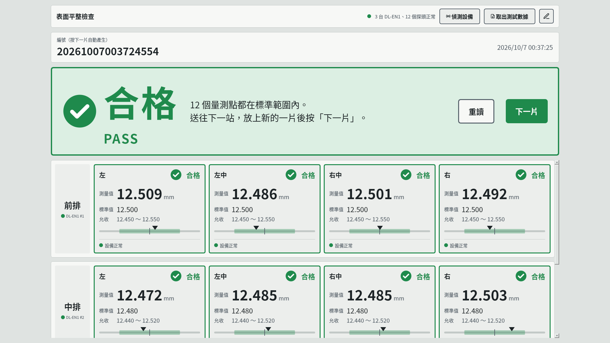
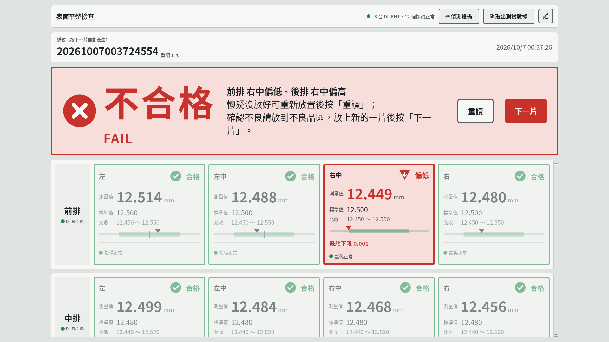
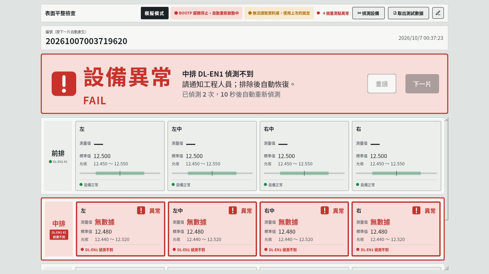
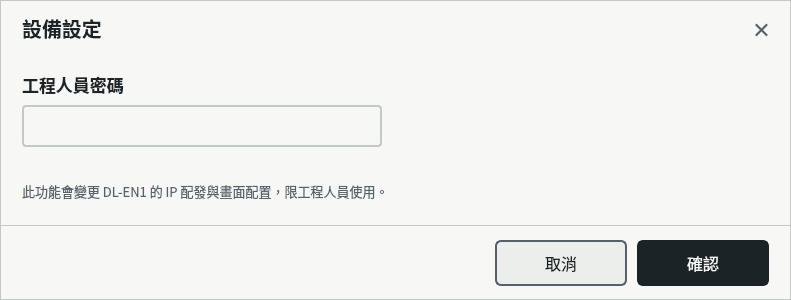
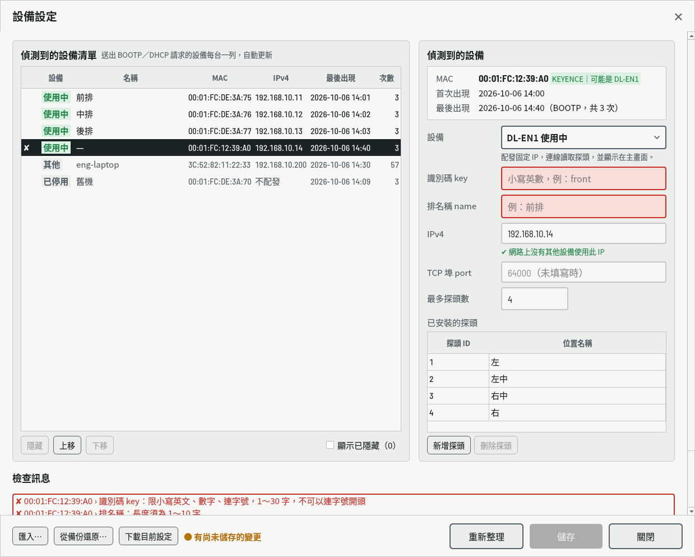
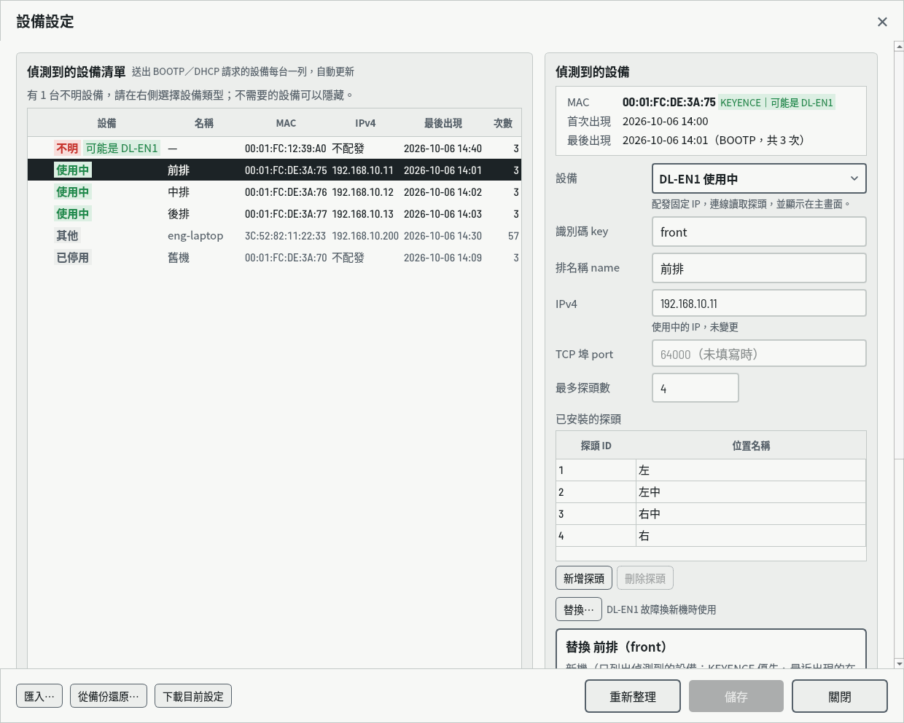
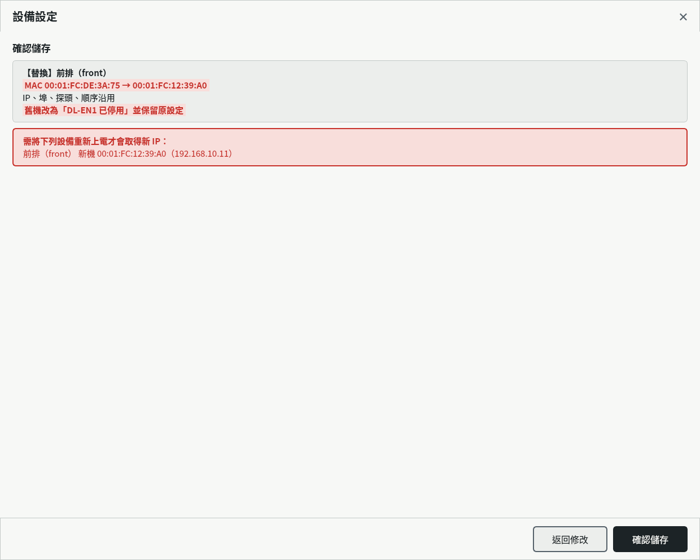

# 畫面說明：主畫面與設備設定（目前實作）

> 對象：要把其他頁面整合進表面平整檢查系統 App 的開發者
> 狀態：描述 repo 目前的實作（2026-10-07）。外觀與行為依 [畫面設計規格](screen-design-spec.md) 與 [HTML 原型](prototype/board-station.html) 實作；與設計規格不同之處列在 §6，尚未實作的部分列在 §7。
> 規格依據：`Downloads/表面平整檢查系統_需求規格書.md` 3.1～3.4、3.7、3.8、3.10

## 1. 畫面一覽

| 畫面 | 類別（`app/flatness/ui/`） | 型態 | 開啟方式 |
| --- | --- | --- | --- |
| 主畫面 | `main_window.MainWindow` | `QMainWindow`（產線 `--fullscreen`） | App 啟動 |
| 取出測試數據 | `main_window.ExportDialog` | 無邊框模態 `QDialog` | 工具列「取出測試數據」 |
| 設備設定 | `settings_dialog.SettingsDialog` | 無邊框模態 `QDialog`，三步驟 `QStackedWidget` | 工具列鉛筆按鍵 |

開啟對話框時主畫面蓋上黑色 45% 遮罩（`widgets.Backdrop`），對話框嵌入遮罩內並置於主畫面中央；對話框或主畫面改變大小時重新置中（UI-09）。倒數、讀取、偵測中，三個工具按鍵停用。

## 2. 共用元件與樣式

| 模組 | 內容 |
| --- | --- |
| `ui/theme.py` | 色票 `C`（設計規格第 2 節，淺色主題）、字型（Noto Sans CJK TC；數字用隨附的 Barlow Semi Condensed，等寬數字）、全 App 的 QSS。按鍵以 `setProperty("kind", "primary"/"small"/"tool"/"icon"/"danger")` 套用樣式；輸入框錯誤以 `setProperty("error", True)` 標紅 |
| `ui/icons.py` | 設計規格第 6 節的 8 個 SVG 圖示，`pixmap(name, color, size)` 依狀態色繪製 |
| `ui/widgets.py` | `Toast`（5.9 提示訊息）、`Backdrop`（遮罩）、`Dot`（5.7 指示點，可閃爍） |
| `app/flatness/fonts/` | Barlow Semi Condensed（SIL OFL，授權檔 `OFL.txt`），啟動時以 `QFontDatabase.addApplicationFont()` 載入 |

新頁面請沿用 `theme.qss()` 與上述元件，不要另訂色碼。

## 3. 主畫面（`MainWindow`）

由上而下：頂端工具列 → 編號列 → 結果橫幅 → 每台「DL-EN1 使用中」一排（只有排與探頭區可捲動）。

| 部位 | 類別 | 說明 |
| --- | --- | --- |
| 頂端工具列 | `MainWindow._topbar()` | 標題、系統狀態提示（`set_flag()`）、設備狀態摘要、「偵測設備」「取出測試數據」、鉛筆按鍵 |
| 編號列 | `MainWindow._serialbar()` | 17 碼編號（DAT-01）、重讀次數、每秒更新的時鐘 |
| 結果橫幅 | `Banner.set(state, …)` | `detecting`／`booting`／`idle`／`countdown`／`reading`／`pass`／`fail`／`error`，按鍵可用性依 5.3 |
| 排 | `DeviceRow` | 排名稱、DL-EN1 標示；偵測不到時整排紅框（5.4） |
| 探頭方塊 | `ProbeTile` | `set_blank()`、`set_result(state, value, note, …)`、`fade()`（5.5） |
| 刻度條 | `ScaleBar` | 5.6 公式，`paintEvent` 繪製 |

**流程**

| 操作 | 行為 | 需求 |
| --- | --- | --- |
| 啟動 | 自動偵測設備（`detect()`）；全部正常 → 待放置 | DEV-01 |
| 下一片 | 先寫入畫面上的結果（`flush_result()`）→ 新編號 → 倒數 → 讀取 → 判定 | MEA-01～MEA-04 |
| 重讀 | 編號不變、重讀次數加 1，重新倒數與讀取；不寫入 | MEA-05、MEA-06 |
| 設備異常 | 列出原因，每 10 秒自動重新偵測並顯示倒數 | DEV-05、DEV-06、JDG-04 |
| 關閉程式（含 SIGTERM／SIGHUP） | 寫入畫面上未寫入的結果，停止 dnsmasq | DAT-05、DSC-07 |

偵測與讀取在背景執行緒執行（`MainWindow._run()`），完成後以 Qt signal 回到畫面執行緒。

## 4. 設備設定（`SettingsDialog`）

三個步驟：密碼 → 編輯 → 確認儲存（設計規格 5.10）。

| 部位 | 說明 |
| --- | --- |
| 偵測到的設備清單 | `QTableWidget`，排序依 DSC-02；「設備」欄由 `HtmlDelegate` 繪製類型標籤；探索到新設備時自動更新（`Backend.devices_seen` → 300 ms 合併後重讀資料庫） |
| 清單按鍵 | 隱藏／取消隱藏（按下即寫入資料庫）、上移、下移、「顯示已隱藏（N）」 |
| 偵測到的設備 | 唯讀資訊框（MAC、KEYENCE 提示、首次／最後出現、主機名稱、廠商識別）＋ 表單；依設備類型顯示欄位（`QFormLayout.setRowVisible`） |
| IPv4 檢查 | 先比對資料表（顯示佔用者），再於離開欄位時在背景做 ARP 探測（`Backend.probe_async`） |
| 替換 | 只對「DL-EN1 使用中」；候選為不明、其他、已停用設備 |
| 檢查訊息 | 每次輸入即重新檢查（`lan.validate`）；點擊跳到該台 |
| 按鍵列 | 匯入…、從備份還原…、下載目前設定／重新整理、儲存、關閉 |

**儲存**：先寫入主畫面上未寫入的量測結果（`before_save`，UPL-02）→ `Backend.apply()`（交易內寫入資料庫 → 產生定義檔與 BOOTP 主機對應 → 主機對應有變更時重新啟動 dnsmasq；失敗全部還原）→ 發出 `saved(result, preview)` → 主畫面清除編號、重建排、自動偵測，並提示需重新上電的設備。

## 5. 整合介面

### 5.1 服務層（`app/flatness/backend.py` 的 `Backend`）

畫面只透過 `Backend` 存取資料。新頁面需要資料庫或設備資訊時，請在 `Backend` 增加方法，不要在畫面中直接連線資料庫。

| 成員 | 用途 |
| --- | --- |
| `start()`／`shutdown()` | 啟動：依資料庫產生檔案 → 啟動 dnsmasq 與探索；結束：停止 dnsmasq |
| `definition` | 目前畫面使用的定義檔內容（只含使用中，依畫面順序） |
| `load_devices()`／`cached_devices()` | 讀取 `lan_device`；資料庫無法連線時用後者 |
| `apply(old, new, summary)` | 套用設備設定 |
| `standards()` | 允收標準 `{key: {probe_id: Standard}}` |
| 訊號 `devices_seen`、`bootp_state`、`db_state` | 探索到設備、BOOTP 服務狀態、資料庫狀態 |

### 5.2 不含 Qt 的模組

| 模組 | 內容 |
| --- | --- |
| `lan.py` | `LanDevice`、五種狀態、檢查規則、預設 IP、替換、差異預覽 |
| `store.py` | `MySQLStore`（正式）、`MemoryStore`（測試） |
| `sync.py` | 資料庫 → 定義檔與 BOOTP 主機對應（DSC-06）、套用與還原 |
| `discovery.py` | 解析 dnsmasq 輸出、背景寫入資料庫（資料庫斷線時暫存） |
| `dnsmasq.py` | 以子程序執行 dnsmasq，異常結束自動重新啟動 |
| `netinfo.py` | 設備網卡位址、ARP 探測 |
| `measure.py` | 判定（JDG-01～JDG-04）與示範量測來源 `DemoStation` |
| `config.py` | `config.toml`（允收標準、倒數秒數、工程人員密碼雜湊、預設 IP 範圍） |

### 5.3 整合注意事項

- 新的模態對話框請用 `MainWindow._modal(dlg)` 開啟，才會蓋上遮罩並置中（UI-09）；對話框可實作 `fit()` 依主畫面大小調整尺寸；倒數、讀取、偵測中（`MainWindow.busy`）不可開啟。
- 背景工作不可在畫面執行緒阻斷：沿用 `threading` ＋ Qt signal 回到畫面執行緒的做法。
- 測試以 `QT_QPA_PLATFORM=offscreen` 執行（`tests/test_ui.py`）；`Backend` 可搭配 `MemoryStore`、不啟動 dnsmasq、注入假的 ARP 探測。

## 6. 與畫面設計規格不同之處

| 項目 | 設計規格 | 目前實作 | 原因 |
| --- | --- | --- | --- |
| 儲存失敗 | 5.10「儲存後」：先關閉對話框再寫入 | 寫入成功才關閉；失敗時留在確認頁並顯示原因 | 失敗時不遺失使用者的編輯內容 |
| 量測後設備異常排除 | 5.3 未定義 | 自動偵測恢復後顯示「待放置」，說明「按『重讀』重新量測此片，或放上新的一片後按『下一片』」，兩鍵皆可按；畫面上的 ERROR 結果在按「下一片」時寫入 | 讓作業員能繼續作業，且不遺失該片紀錄 |
| 資料庫無法連線時開啟設備設定 | 未定義 | 顯示上次讀到的清單與尚未寫入的探索紀錄，唯讀，不能儲存 | DSC-05-G1「清單於畫面上可見」 |
| 捲動 | 原型整頁捲動 | 只有排與探頭區捲動，工具列、編號列與結果橫幅固定 | 結果橫幅一律可見 |

## 7. 尚未實作

| 項目 | 需求 | 目前 |
| --- | --- | --- |
| DL-EN1 連線、偵測與讀值 | DEV、MEA、DEF-05、DEF-06 | 主畫面使用 `DemoStation`（隨機數值），啟動時日誌標示為示範 |
| 量測結果寫入資料庫、斷線暫存與補寫、待同步筆數 | DAT-02～DAT-06 | `MemorySink` 只存在記憶體；按「下一片」提示「示範模式：編號 … 未寫入資料庫」 |
| 取出測試數據（Excel） | EXP-01～EXP-05 | 對話框已完成；筆數來自 `MemorySink`，存檔顯示「尚未實作」 |
| 模擬器（SIM） | 3.9 | `--simulate` 只停用 dnsmasq 與探索並顯示「模擬模式」 |
| 深色主題、窄螢幕調整 | 設計規格第 2、8 節（選配） | 未實作 |
