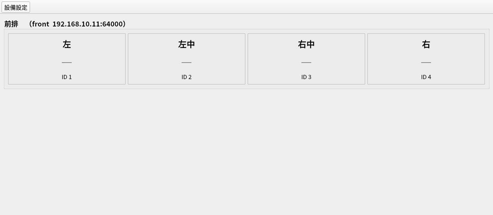
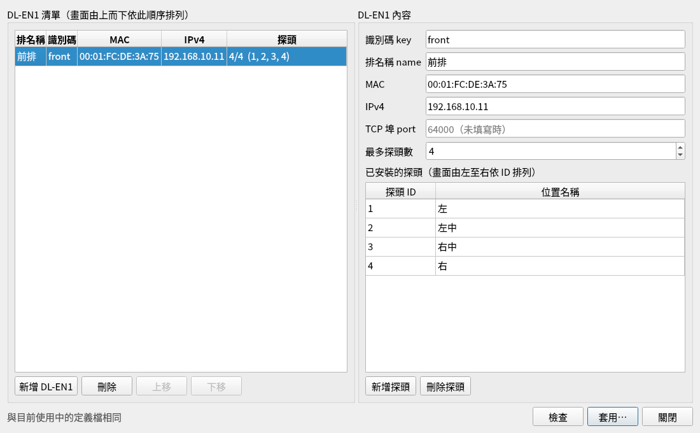
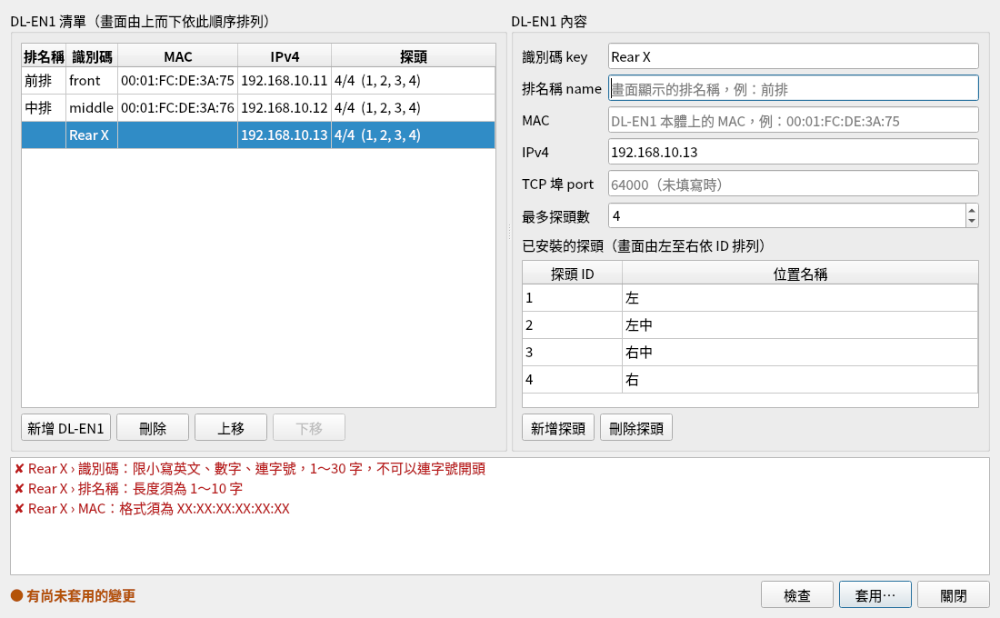
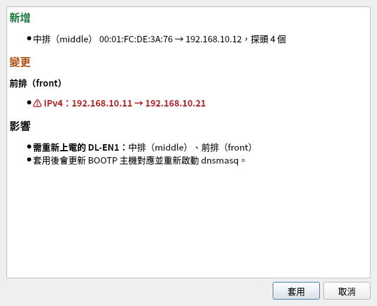

# 畫面說明：主畫面與設備設定（目前實作）

> 對象：要把其他頁面整合進表面平整檢查系統 App 的開發者
> 狀態：描述 repo 目前的實作（2026-10-06，commit `8bc92da` 時的程式）；規格已定但尚未實作的部分集中在 §7
> 規格依據：`Downloads/表面平整檢查系統_需求規格書.md` 3.4（UI）、3.7（DEF）、3.8（UPL／EDT）、3.10（DSC）
> **目標畫面**：見 [畫面設計規格](screen-design-spec.md) 與 [HTML 原型](prototype/board-station.html)。本文件只描述目前程式的實作，兩者不同時以畫面設計規格為準。

## 1. 畫面一覽與流程

| 畫面 | 類別（`app/flatness/ui/`） | 型態 | 開啟方式 |
| --- | --- | --- | --- |
| 主畫面 | `main_window.MainWindow` | `QMainWindow` | App 啟動 |
| 設備設定 | `device_editor.DeviceEditor` | `QDialog`，模態（`exec()`） | 主畫面工具列「設備設定」 |
| 差異預覽 | `device_editor.PreviewDialog` | `QDialog`，模態 | 設備設定按「套用…」且檢查通過、有變更時 |
| 訊息框 | `QMessageBox` | 模態 | 見 §5 |

```
主畫面 ──[設備設定]──▶ 設備設定 ──[套用…]──▶ 檢查 ──有錯──▶ 錯誤清單（停在設備設定）
                          ▲                    │
                          │                 無變更 ──▶ 訊息「沒有變更。」
                          │                    │
                          │                 有變更 ──▶ 差異預覽 ──[取消]──▶ 回設備設定
                          │                                  │
                          │                               [套用]
                          │                                  ▼
                          └──────── 失敗訊息（已還原）◀── 寫檔＋重啟 dnsmasq ──成功──▶ 成功訊息
                                                                                │
                                                       applied 訊號 ──▶ 主畫面 reload_layout()
```

## 2. 共用設定

| 項目 | 內容 |
| --- | --- |
| GUI 框架 | PySide6 6.11.2（`requirements.txt`） |
| 字型 | 依序嘗試 `Noto Sans CJK TC`、`Noto Sans TC`、`Noto Sans CJK JP`，12 pt，設為 App 全域字型（`__main__.py`） |
| 語言 | 畫面文字全部為繁體中文，目前直接寫在程式內（尚無 i18n） |
| 顏色 | 錯誤／移除 `#b91c1c`、警示／變更 `#b45309`、成功／新增 `#15803d`、次要文字 `#555`、未量測數值 `#888` |
| 啟動 | `python -m flatness [選項]`；開發機用 `./scripts/run-dev.sh`（檔案放 `.dev/`、不重啟 dnsmasq） |

啟動選項（`app/flatness/__main__.py`）：

| 選項 | 預設 | 用途 |
| --- | --- | --- |
| `--def` | `/etc/flatness/dl-en1.json` | DL-EN1 定義檔 |
| `--hosts` | `/var/lib/flatness/bootp/dl-en1.hosts` | dnsmasq BOOTP 主機對應檔 |
| `--equip-net` | `192.168.10.1/24` | 量測 PC 設備網卡 IP／遮罩，用於 IP 驗證與預設 IP |
| `--no-restart` | 關 | 套用時不重啟 dnsmasq（開發用） |
| `--log-file` | `/var/log/flatness/flatness.log` | 日誌；無法寫入時只輸出到終端機 |
| `--fullscreen` | 關 | 全螢幕（產線用） |
| `--on-top` | 關 | 視窗保持最上層；Wayland 下需 `QT_QPA_PLATFORM=xcb`（需系統套件 `libxcb-cursor0`） |

## 3. 主畫面（`MainWindow`）



### 3.1 版面

| 區域 | 元件 | 內容 |
| --- | --- | --- |
| 頂端工具列 | `QToolBar`（不可移動、只顯示文字） | 一個動作：「設備設定」（`self.device_action`） |
| 中央 | `self.board`（`QWidget` ＋ `QVBoxLayout`） | 依定義檔產生的量測點版面，見 3.2 |

視窗標題「表面平整檢查系統」；一般模式 1280×800，`--fullscreen` 時全螢幕。

### 3.2 量測點版面（`reload_layout()`）

- 每台 DL-EN1 一個 `QGroupBox`，依定義檔順序由上而下；標題為「`{name}`　（`{key}  {ipv4}:{port}`）」，18 px 粗體。
- 每個探頭一個 `QFrame`（StyledPanel），依探頭 ID 由左至右，內含三行置中文字：
  1. 位置名稱（`description`），22 px 粗體
  2. 測量值：目前固定顯示「—」，32 px、`#888`（量測流程尚未實作）
  3. 「ID {id}」
- 定義檔不存在或為空：中央顯示紅字「尚未設定 DL-EN1，請至「設備設定」新增。」（20 px）。
- 定義檔驗證失敗：中央顯示紅字「DL-EN1 定義檔有錯誤，請至「設備設定」修正：」並逐行列出 `位置: 原因`。

`reload_layout()` 每次會丟棄整個舊版面再重建；在 `self.board` 上保存的子元件參照會失效。

### 3.3 行為

| 觸發 | 行為 |
| --- | --- |
| 啟動 | 呼叫 `reload_layout()` |
| 工具列「設備設定」 | 建立 `DeviceEditor` 並 `exec()`（模態，主畫面期間不可操作） |
| 設備設定套用成功（`applied` 訊號） | 呼叫 `reload_layout()`，版面立即反映新定義檔 |

## 4. 設備設定（`DeviceEditor`）



視窗標題「設備設定 — DL-EN1 清單」，1100×680。開啟時讀取定義檔；讀取失敗（JSON 語法錯誤）時先跳警告「定義檔無法讀取，將從空白清單開始。」再以空清單開啟。

### 4.1 版面

```
┌ DL-EN1 清單（畫面由上而下依此順序排列）──┐┌ DL-EN1 內容 ─────────────────────┐
│ 排名稱│識別碼│MAC│IPv4│探頭               ││ 識別碼 key     [            ]     │
│ ...（device_table）                       ││ 排名稱 name    [            ]     │
│                                           ││ MAC            [            ]     │
│                                           ││ IPv4           [            ]     │
│                                           ││ TCP 埠 port    [            ]     │
│                                           ││ 最多探頭數     [ 4 ▲▼]           │
│                                           ││ 已安裝的探頭（畫面由左至右依 ID 排列）│
│                                           ││ 探頭 ID │ 位置名稱（probe_table）  │
│[新增 DL-EN1][刪除][上移][下移]            ││[新增探頭][刪除探頭]               │
└───────────────────────────────────────────┘└───────────────────────────────────┘
┌ 錯誤清單（error_list，有錯誤時才顯示，最高 130 px）───────────────────────────┐
└───────────────────────────────────────────────────────────────────────────────┘
狀態文字（status）                                        [檢查] [套用…] [關閉]
```

左右兩欄以 `QSplitter` 分隔（初始 560／540，可拖曳）。

### 4.2 元件

| 屬性名稱 | 元件 | 說明 |
| --- | --- | --- |
| `device_table` | `QTableWidget`，5 欄 | 排名稱、識別碼、MAC、IPv4、探頭（格式「已裝數/最多數 (ID, …)」）；整列單選、不可直接編輯 |
| `btn_add` | 新增 DL-EN1 | 已有 8 台時停用 |
| `btn_delete` | 刪除 | 未選取時停用；按下先詢問「確定刪除 …？（按「套用」前不會寫入檔案）」 |
| `btn_up`／`btn_down` | 上移／下移 | 已在最上／最下時停用 |
| `key_edit` | `QLineEdit` | 提示「小寫英文、數字、連字號，例：front」 |
| `name_edit` | `QLineEdit` | 提示「畫面顯示的排名稱，例：前排」 |
| `mac_edit` | `QLineEdit` | 提示「DL-EN1 本體上的 MAC，例：00:01:FC:DE:3A:75」；輸入時自動轉大寫存入 |
| `ip_edit` | `QLineEdit` | 提示「設備網段 {網段} 內」 |
| `port_edit` | `QLineEdit`＋整數驗證 1～65535 | 提示「64000（未填寫時）」；留空即不寫入 `port`（使用預設 64000） |
| `max_spin` | `QSpinBox` 1～15 | 最多探頭數 |
| `probe_table` | `QTableWidget`，2 欄 | 探頭 ID（欄寬 110，表頭提示「等於放大器 ID，依實體串接順序由 1 起算」）、位置名稱；儲存格可直接編輯 |
| `btn_add_probe`／`btn_delete_probe` | 新增探頭／刪除探頭 | 新增時取 1～最多探頭數中最小未使用的 ID；已滿時警告「已達最多探頭數 N；請先調高「最多探頭數」。」 |
| `error_list` | `QListWidget` | 每行「✘ {排名稱} › {欄位} [› 第 n 個探頭 › 欄位]：{原因}」，紅字；點一行會選取該台 DL-EN1 |
| `status` | `QLabel` | 見 4.4 |
| `btn_check`／`btn_apply`／`btn_close` | 檢查／套用…（預設鍵）／關閉 | 見 4.3 |

右欄 `self.detail` 在沒有選取任何 DL-EN1 時整區停用。

### 4.3 行為

| 動作 | 結果 |
| --- | --- |
| 選取左側一列 | 右欄顯示該台內容 |
| 修改右欄任一欄位 | 立即更新記憶體中的清單與左側該列；**不寫入任何檔案** |
| 新增 DL-EN1 | 新增一列並選取：key `dl-en1-N`、名稱與 MAC 空白、IP 為設備網段中主機位址 ≥ .11 且未被使用的最小位址、最多探頭數 4、探頭 1～4「左／左中／右中／右」；游標移到排名稱 |
| 檢查 | 驗證整份清單（3.7.1 規則＋JSON Schema），錯誤列在錯誤清單；通過時狀態顯示「✔ 檢查通過」 |
| 套用… | 先檢查 → 有錯誤：警告「有錯誤，未套用。請依下方清單修正。」→ 無變更：「沒有變更。」→ 有變更：開差異預覽 → 使用者按「套用」→ 寫入（§6）→ 成功或失敗訊息 |
| 關閉／Esc／視窗 × | 有未套用的變更時詢問「有尚未套用的變更，確定放棄並關閉？」 |



### 4.4 狀態文字

| 條件 | 文字 | 樣式 |
| --- | --- | --- |
| 記憶體中的清單 ≠ 目前定義檔 | ● 有尚未套用的變更 | `#b45309` 粗體 |
| 相同 | 與目前使用中的定義檔相同 | `#555` |
| 按「檢查」且通過 | ✔ 檢查通過 | `#15803d` 粗體 |

## 5. 差異預覽（`PreviewDialog`）與訊息



視窗標題「確認套用 — 差異預覽」，640×520；內容為 `QTextBrowser` HTML，按鍵「套用」「取消」。

| 區段 | 顯示條件 | 內容 |
| --- | --- | --- |
| 新增（綠） | 有新 key | `{名稱}（{key}）　{MAC} → {IP}，探頭 N 個` |
| 移除（紅） | 有 key 不見 | `{名稱}（{key}）　{MAC}` |
| 變更（橘） | 同 key 有差異 | 每台一段；MAC、IPv4 變更以紅色粗體「⚠」標示；另含排名稱、埠、最多探頭數、探頭新增／移除／改名 |
| 排列順序 | 順序改變 | 「畫面排列順序已調整。」 |
| 影響 | 一律 | 需重新上電的 DL-EN1、將從畫面移除的量測點；或「無需重新上電，無量測點被移除。」；最後一行固定「套用後會更新 BOOTP 主機對應並重新啟動 dnsmasq。」 |

修改 key 會被視為「移除舊的＋新增新的」。

訊息框（標題皆為「設備設定」）：

| 時機 | 類型 | 文字 |
| --- | --- | --- |
| 套用成功 | 資訊 | 「已套用：定義檔與 BOOTP 主機對應已更新，dnsmasq 已重新啟動。」；有 MAC／IP 變更或新增時，另列「請將下列 DL-EN1 重新上電，以取得新的 IP：」與「• 名稱（key）  MAC → IP」 |
| 套用失敗 | 警告 | 「套用失敗，已還原為套用前的設定。\n\n原因：{例外訊息}」，畫面保留編輯內容，可修正後再套用 |

## 6. 整合介面

### 6.1 類別與訊號

```python
from flatness.ui.main_window import MainWindow
from flatness.ui.device_editor import DeviceEditor, PreviewDialog

MainWindow(def_path, hosts_path, equip_net, restart_cmd=bootp.RESTART_CMD)
    .device_action        # QAction「設備設定」；新頁面的動作可加在同一個工具列
    .open_device_editor() # 開啟設備設定（模態）
    .reload_layout()      # 依定義檔重建中央版面

DeviceEditor(def_path, hosts_path, equip_net, restart_cmd=bootp.RESTART_CMD, parent=None)
    .applied              # Signal(dict)：套用成功後送出新的完整定義 {"version": 1, "dl_en1": [...]}
    .current_definition() # 目前畫面上（可能未套用）的定義
    .is_dirty()           # 是否有未套用的變更
    ._confirm(diff) / ._ask(text) / ._info(text) / ._warn(text)
                          # 所有對話框都經過這四個方法，測試或嵌入時可替換（見 tests/test_device_editor.py）

PreviewDialog(diff, parent=None)
PreviewDialog.render(diff) -> str  # 只要 HTML、不開視窗時使用
```

- `equip_net`：`ipaddress.IPv4Interface`，例如 `IPv4Interface("192.168.10.1/24")`。
- `restart_cmd`：`None` 表示不重啟 dnsmasq；正式環境為 `["sudo", "-n", "/usr/bin/systemctl", "restart", "dnsmasq"]`。

### 6.2 不含 Qt 的邏輯（`app/flatness/definition.py`、`bootp.py`）

其他頁面需要讀取或檢查 DL-EN1 清單時，直接用這兩個模組，不要經過畫面：

| 函式 | 用途 |
| --- | --- |
| `definition.load_definition(path)` | 讀定義檔；不存在回傳空清單；語法錯誤拋 `bootp.DefinitionError` |
| `definition.validate(defn, equip_net)` | 回傳 `[(位置, 原因), …]`，空 list 表示通過 |
| `definition.diff(old, new)` | 回傳 `Diff`：`added`、`removed`、`changed`、`reordered`、`power_cycle`、`removed_points`、`empty`、`summary()` |
| `definition.apply(defn, def_path, hosts_path, equip_net, restart_cmd)` | 驗證 → 備份 → 原子寫定義檔 → 寫 BOOTP 對應 → 重啟；失敗還原兩個檔案並拋出例外 |

### 6.3 整合注意事項

- **頁面架構：** 中央區域目前只有量測點版面（`self.board`），沒有分頁機制。要加入其他全畫面頁面時，建議把中央改為 `QStackedWidget`，`board` 作為第一頁，新頁面由工具列動作切換；設定類頁面可比照設備設定做成模態 `QDialog`。
- **模態：** 設備設定開啟期間主畫面不可操作。規格 UPL-02 要求倒數／讀取中停用「設備設定」，整合量測頁面時須依量測狀態啟用／停用 `device_action`。
- **版面重建：** `reload_layout()` 會重建整個 `board`；其他頁面若需要在 DL-EN1 設定改變時更新，請連接 `DeviceEditor.applied`，或在主畫面加一個轉發訊號，不要保存 `board` 內子元件的參照。
- **Wayland：** 在 GNOME Wayland 下由終端機啟動的視窗不會自動移到最上層；產線以 `--fullscreen` 啟動。
- **測試：** 畫面測試用 `QT_QPA_PLATFORM=offscreen`，以替換 `_confirm`／`_ask`／`_info`／`_warn` 的方式避開模態對話框；執行 `QT_QPA_PLATFORM=offscreen .venv/bin/python -m pytest tests`。

## 7. 與規格的差距（尚未實作，整合時請預留）

| 規格 | 內容 | 對畫面的影響 |
| --- | --- | --- |
| UPL-01 | 進入「設備設定」須輸入工程人員密碼 | 開啟設備設定前多一個密碼對話框 |
| UPL-02 | 倒數、讀取、偵測中停用設備設定；有未寫入的量測結果先寫入 | `device_action` 依量測狀態啟用／停用 |
| UPL-08 | 套用後自動執行偵測設備 | 套用成功後觸發偵測（DEV 尚未實作） |
| DSC-06、DSC-12 | DL-EN1 設定改以資料庫 `lan_device` 為主檔，App 啟動時產生定義檔 | 設備設定改寫資料庫；主畫面在資料庫無法連線時顯示「無法讀取資料庫，使用上次的設定」 |
| DSC-07 | dnsmasq 由 App 啟動與管理 | `restart_cmd` 改為 App 內部重啟子程序；dnsmasq 停止時主畫面顯示「BOOTP 服務停止」 |
| DSC-02～DSC-04、DSC-08～DSC-11、DSC-13、DSC-14 | 設備清單（探索到的設備、四種狀態、隱藏、替換、IP 預設與佔用檢查） | 設備設定將增加「設備清單」區塊或分頁；目前的 DL-EN1 編輯畫面成為「DL-EN1 使用中」的設定介面 |
| SIM-14 | 模擬模式全程顯示「模擬模式」標示 | 主畫面需預留標示位置 |
| UI-01～UI-08 | 量測畫面（編號列、結果橫幅、12 點狀態與刻度條） | 目前的量測點版面只是暫時的位置示意，將由量測畫面取代 |
